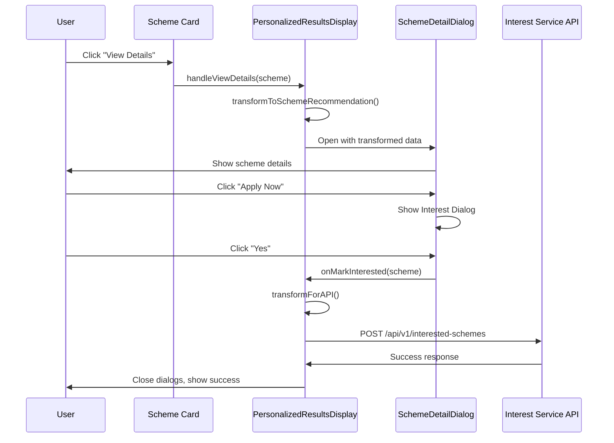

# Design Document: Recommended Schemes Interest Feature

## Overview

This feature extends the PersonalizedResultsDisplay component on the home page to support the "I am interested" functionality that currently exists only on the schemes page. Users will be able to view detailed information about recommended schemes and mark their interest directly from the home page, creating a consistent user experience across the application.

The implementation reuses existing components (SchemeDetailDialog) and patterns from the Schemes page, ensuring code reusability and behavioral consistency. The key technical challenge is adapting the PersonalizedScheme data structure (used for AI recommendations) to work with the existing SchemeDetailDialog component (designed for SchemeRecommendation data) and the Interest Service API.

### Key Design Decisions

1. **Component Reuse**: Leverage existing SchemeDetailDialog component rather than creating a new dialog, ensuring UI/UX consistency
2. **Data Transformation Layer**: Create an adapter function to transform PersonalizedScheme to SchemeRecommendation format
3. **State Management**: Add dialog state management to PersonalizedResultsDisplay component
4. **API Integration**: Reuse existing Interest Service endpoint with proper data mapping
5. **Accessibility**: Maintain WCAG 2.1 AA compliance through proper ARIA attributes and focus management

## Architecture

### Component Hierarchy

```
Home Page
└── PersonalizedResultsDisplay (modified)
    ├── Scheme Cards (modified)
    │   ├── View Details Button (new)
    │   └── Apply Now Button (existing, conditional)
    └── SchemeDetailDialog (reused)
        └── Interest Dialog (reused)
```

### Data Flow



### State Management

The PersonalizedResultsDisplay component will manage the following state:

- `selectedScheme`: Currently selected PersonalizedScheme for detail view
- `dialogOpen`: Boolean flag for SchemeDetailDialog visibility
- `transformedScheme`: SchemeRecommendation format for dialog consumption

## Components and Interfaces

### Modified: PersonalizedResultsDisplay Component

**New Props**: None (component remains self-contained)

**New State**:
```typescript
const [selectedScheme, setSelectedScheme] = useState<PersonalizedScheme | null>(null);
const [dialogOpen, setDialogOpen] = useState(false);
```

**New Methods**:

1. `handleViewDetails(scheme: PersonalizedScheme): void`
   - Sets selectedScheme state
   - Opens dialog by setting dialogOpen to true

2. `handleCloseDialog(): void`
   - Closes dialog
   - Clears selectedScheme state

3. `handleMarkInterested(scheme: SchemeRecommendation): Promise<void>`
   - Retrieves profileId from localStorage
   - Transforms scheme data to API format
   - Sends POST request to Interest Service
   - Handles success/error responses
   - Closes dialog on completion

4. `transformToSchemeRecommendation(scheme: PersonalizedScheme): SchemeRecommendation`
   - Converts PersonalizedScheme to SchemeRecommendation format
   - Maps fields appropriately for dialog consumption

5. `transformForAPI(scheme: PersonalizedScheme, profileId: string): InterestedSchemeCreateRequest`
   - Converts PersonalizedScheme to API request format
   - Provides default values for missing fields

**UI Changes**:
- Add "View Details" button to each scheme card
- Conditionally render both "View Details" and "Apply Now" buttons when apply_link exists
- Render only "View Details" button when apply_link is missing
- Add SchemeDetailDialog component with proper props

### Reused: SchemeDetailDialog Component

No modifications required. The component already supports:
- Displaying scheme details
- "Apply Now" button with interest dialog
- onMarkInterested callback
- Accessibility features (focus trap, ARIA labels)

The component will receive transformed SchemeRecommendation data from PersonalizedResultsDisplay.

### Data Transformation Functions

#### transformToSchemeRecommendation

Converts PersonalizedScheme to SchemeRecommendation format for dialog display:

```typescript
function transformToSchemeRecommendation(
  scheme: PersonalizedScheme
): SchemeRecommendation {
  return {
    scheme: {
      schemeId: scheme.schemeId || scheme.id || scheme.slug,
      officialName: scheme.name,
      localizedName: scheme.name,
      shortDescription: scheme.description || '',
      category: scheme.category || 'general',
      level: (scheme.scheme_type as 'central' | 'state') || 'central',
      officialWebsite: scheme.apply_link || undefined,
      helplineNumber: undefined,
    },
    eligibility: {
      eligible: true,
      confidence: scheme.final_score || scheme.confidence || 0.8,
      explanation: scheme.explanation?.join(' ') || 
                   scheme.reason || 
                   scheme.eligibility_analysis || 
                   'Matched based on your profile',
    },
    estimatedBenefit: scheme.estimatedBenefit || 0,
    priority: 1,
    personalizedExplanation: scheme.benefits_summary || 
                             scheme.benefits || 
                             scheme.reasoning || '',
  };
}
```

#### transformForAPI

Converts PersonalizedScheme to InterestedSchemeCreateRequest format:

```typescript
function transformForAPI(
  scheme: PersonalizedScheme,
  profileId: string
): InterestedSchemeCreateRequest {
  return {
    profile_id: profileId,
    scheme_name: scheme.name,
    scheme_slug: scheme.slug,
    scheme_description: scheme.description || '',
    scheme_benefits: scheme.benefits_summary || scheme.benefits || '',
    scheme_ministry: scheme.ministry,
    scheme_apply_link: scheme.apply_link || '',
  };
}
```

## Data Models

### PersonalizedScheme (Existing)

```typescript
interface PersonalizedScheme {
  schemeId?: string;
  id?: string;
  name: string;
  slug: string;
  description?: string;
  category?: string;
  level?: string;
  ministry: string;
  state?: string;
  similarityScore?: number;
  confidence?: number | string;
  reasoning?: string;
  estimatedBenefit?: number;
  final_score?: number;
  semantic_score?: number;
  eligibility_score?: number;
  eligibility_score_raw?: number;
  explanation?: string[];
  reason?: string;
  benefits?: string;
  benefits_summary?: string;
  eligibility?: string;
  eligibility_analysis?: string;
  apply_link?: string;
  state_match?: boolean;
  scheme_type?: string;
  is_fallback?: boolean;
  fallback_category?: string;
}
```

### SchemeRecommendation (Existing)

```typescript
interface SchemeRecommendation {
  scheme: GovernmentScheme;
  eligibility: {
    eligible: boolean;
    confidence: number;
    explanation: string;
  };
  estimatedBenefit: number;
  priority: number;
  personalizedExplanation: string;
}
```

### InterestedSchemeCreateRequest (Existing)

```typescript
interface InterestedSchemeCreateRequest {
  profile_id: string;
  scheme_name: string;
  scheme_slug?: string;
  scheme_description?: string;
  scheme_benefits?: string;
  scheme_ministry?: string;
  scheme_apply_link?: string;
}
```

### Field Mapping

| PersonalizedScheme | SchemeRecommendation.scheme | InterestedSchemeCreateRequest |
|-------------------|----------------------------|-------------------------------|
| name | officialName, localizedName | scheme_name |
| slug | schemeId | scheme_slug |
| description | shortDescription | scheme_description |
| category | category | - |
| scheme_type | level | - |
| ministry | - | scheme_ministry |
| apply_link | officialWebsite | scheme_apply_link |
| benefits_summary / benefits | - | scheme_benefits |
| final_score / confidence | eligibility.confidence | - |
| explanation / reason | eligibility.explanation | - |
| estimatedBenefit | estimatedBenefit | - |


## Correctness Properties

*A property is a characteristic or behavior that should hold true across all valid executions of a system—essentially, a formal statement about what the system should do. Properties serve as the bridge between human-readable specifications and machine-verifiable correctness guarantees.*

### Property Reflection

After analyzing all acceptance criteria, several properties can be consolidated:

- Properties 1.2 and 1.3 (button rendering based on apply_link) can be combined into a single property about conditional button rendering
- Properties 7.1-7.6 (field extraction) can be combined into a single property about data transformation completeness
- Properties 8.2-8.5 (dialog ARIA attributes) are specific examples that should be tested as unit tests, not properties
- Property 2.2 and 2.3 (dialog content display) can be combined into a single property about complete data rendering
- Properties 4.3 and 4.4 (success/error handling) can be combined into a single property about response handling

### Property 1: View Details Button Presence

*For any* recommended scheme card rendered by PersonalizedResultsDisplay, the card should contain a "View Details" button with an aria-label that includes the scheme name.

**Validates: Requirements 1.1, 1.5, 8.1**

### Property 2: Conditional Button Rendering

*For any* recommended scheme, if the scheme has an apply_link, both "View Details" and "Apply Now" buttons should be rendered; otherwise, only the "View Details" button should be rendered.

**Validates: Requirements 1.2, 1.3**

### Property 3: Dialog Opens on Click

*For any* scheme card, clicking the "View Details" button should transition the dialog state from closed to open.

**Validates: Requirements 2.1**

### Property 4: Complete Scheme Data Display

*For any* scheme displayed in the SchemeDetailDialog, the dialog should render all available fields including name, description, category, level, ministry, and eligibility explanation.

**Validates: Requirements 2.2, 2.3**

### Property 5: Focus Trap in Open Dialog

*For any* open dialog, pressing Tab should cycle focus only among interactive elements within the dialog, never moving focus outside the dialog.

**Validates: Requirements 2.5, 8.7**

### Property 6: Focus Return on Close

*For any* dialog that was opened by clicking an element, closing the dialog should return focus to that triggering element.

**Validates: Requirements 2.6**

### Property 7: Interest Dialog Trigger

*For any* scheme detail dialog opened from a recommended scheme, clicking "Apply Now" should open the Interest Dialog when a valid profile_id exists.

**Validates: Requirements 3.1**

### Property 8: Interest Dialog Persistence

*For any* open Interest Dialog, the dialog should remain open until the user explicitly clicks "Yes" or "No".

**Validates: Requirements 3.6**

### Property 9: Interest Confirmation Triggers API Call

*For any* scheme, clicking "Yes" in the Interest Dialog should trigger a POST request to /api/v1/interested-schemes with all required fields populated.

**Validates: Requirements 3.4, 4.1, 4.2**

### Property 10: Interest Rejection Closes Without Saving

*For any* scheme, clicking "No" in the Interest Dialog should close both dialogs without making any API calls.

**Validates: Requirements 3.5**

### Property 11: Dialog Closure After Save

*For any* interest save operation (whether successful or failed), both the Interest Dialog and Scheme Detail Dialog should close after the operation completes.

**Validates: Requirements 4.5**

### Property 12: Interest Data Round Trip

*For any* scheme marked as interested, saving the interest and then retrieving interested schemes for that profile_id should return a record containing the same scheme_name and scheme_slug.

**Validates: Requirements 4.6**

### Property 13: Data Transformation Completeness

*For any* PersonalizedScheme, transforming it to InterestedSchemeCreateRequest format should map all available fields (name→scheme_name, slug→scheme_slug, description→scheme_description, benefits_summary/benefits→scheme_benefits, ministry→scheme_ministry, apply_link→scheme_apply_link), with empty strings as defaults for missing fields.

**Validates: Requirements 7.1, 7.2, 7.3, 7.4, 7.5, 7.6, 7.7**

### Property 14: Missing Profile ID Prevents API Call

*For any* attempt to mark interest, if no profile_id exists in either props or localStorage, the system should not make any API calls to the Interest Service.

**Validates: Requirements 6.2, 6.4**

### Property 15: Consistent Error Messages

*For any* error scenario (API failure, missing profile), the error messages displayed should be identical whether the error occurs from recommended schemes or from the schemes page.

**Validates: Requirements 5.4**

## Error Handling

### Missing Profile ID

**Scenario**: User attempts to mark interest without a valid profile_id

**Handling**:
1. Check profileId prop first
2. If prop is null/undefined, check localStorage.getItem('profileId')
3. If both are missing, log error: "No profile ID found"
4. Close dialog without showing Interest Dialog
5. Do not attempt API call

**User Feedback**: Silent failure (dialog closes) to avoid confusing users who may not understand profile concepts

### API Request Failure

**Scenario**: POST request to /api/v1/interested-schemes fails

**Handling**:
1. Catch error in try-catch block
2. Log error with sanitized message: "Failed to mark scheme as interested"
3. Close both dialogs
4. Optionally display error toast/snackbar (implementation detail)

**User Feedback**: Error message should be user-friendly and not expose technical details

### Missing Scheme Data

**Scenario**: PersonalizedScheme object is missing required fields

**Handling**:
1. Use default values in transformation functions
2. Empty string for missing text fields
3. Scheme slug as fallback for schemeId
4. Continue with partial data rather than failing

**User Feedback**: No user-facing error; system degrades gracefully

### Network Timeout

**Scenario**: API request takes too long to respond

**Handling**:
1. Implement timeout on fetch request (e.g., 10 seconds)
2. Catch timeout error
3. Log error message
4. Close dialogs
5. Allow user to retry by clicking "Apply Now" again

**User Feedback**: "Request timed out. Please try again."

### Invalid Response Format

**Scenario**: API returns unexpected response structure

**Handling**:
1. Check response.ok before processing
2. Validate response JSON structure
3. Log error if validation fails
4. Close dialogs
5. Treat as API failure

**User Feedback**: Generic error message about saving failure

## Testing Strategy

### Dual Testing Approach

This feature requires both unit tests and property-based tests for comprehensive coverage:

- **Unit tests** verify specific examples, edge cases, and error conditions
- **Property tests** verify universal properties across all inputs
- Both are complementary and necessary

### Unit Testing Focus

Unit tests should cover:

1. **Specific Examples**:
   - Dialog renders with specific scheme data
   - Interest Dialog displays correct text
   - Buttons have correct ARIA attributes (role="dialog", aria-labelledby)

2. **Edge Cases**:
   - Scheme with missing apply_link
   - Scheme with missing description
   - Scheme with missing benefits
   - Empty scheme name handling

3. **Error Conditions**:
   - Missing profile_id in both prop and localStorage
   - API returns 400/500 error
   - Network timeout
   - Invalid response format

4. **Integration Points**:
   - SchemeDetailDialog receives correct props
   - handleMarkInterested callback is invoked
   - API endpoint receives correct payload

### Property-Based Testing Configuration

**Library**: fast-check (for TypeScript/React)

**Configuration**:
- Minimum 100 iterations per property test
- Each test tagged with: `Feature: recommended-schemes-interest-feature, Property {number}: {property_text}`

**Property Test Implementation**:

Each correctness property (1-15) should be implemented as a single property-based test:

1. **Property 1**: Generate random PersonalizedScheme objects, render cards, assert "View Details" button exists with proper aria-label
2. **Property 2**: Generate schemes with/without apply_link, assert correct button count
3. **Property 3**: Generate random schemes, simulate click, assert dialog state changes
4. **Property 4**: Generate schemes with various field combinations, assert all fields render in dialog
5. **Property 5**: Generate random dialogs, simulate Tab key presses, assert focus stays within dialog
6. **Property 6**: Generate random trigger elements, open/close dialog, assert focus returns
7. **Property 7**: Generate schemes, simulate "Apply Now" click with valid profile_id, assert Interest Dialog opens
8. **Property 8**: Generate random Interest Dialogs, wait random time, assert dialog remains open
9. **Property 9**: Generate schemes, simulate "Yes" click, assert API call made with correct payload
10. **Property 10**: Generate schemes, simulate "No" click, assert no API calls made
11. **Property 11**: Generate schemes, simulate save operations (success/failure), assert dialogs close
12. **Property 12**: Generate schemes, save interest, retrieve by profile_id, assert data matches
13. **Property 13**: Generate PersonalizedScheme objects with various field combinations, transform, assert all fields mapped correctly
14. **Property 14**: Generate schemes, attempt interest with missing profile_id, assert no API calls
15. **Property 15**: Generate error scenarios from both contexts, assert error messages match

**Generators**:

Create custom generators for:
- `PersonalizedScheme` with optional fields
- `SchemeRecommendation` with required fields
- `InterestedSchemeCreateRequest` with all fields
- Profile IDs (valid/invalid/missing)
- API responses (success/error)

### Test Coverage Goals

- **Line Coverage**: >90%
- **Branch Coverage**: >85%
- **Function Coverage**: >95%
- **Property Test Iterations**: 100 per property

### Accessibility Testing

While property-based tests cover ARIA attributes, manual testing should verify:
- Screen reader announcements (NVDA, JAWS, VoiceOver)
- Keyboard navigation flow
- Focus visibility
- Color contrast ratios
- Touch target sizes (mobile)

Note: Automated tests cannot fully validate WCAG compliance. Manual testing with assistive technologies is required.
