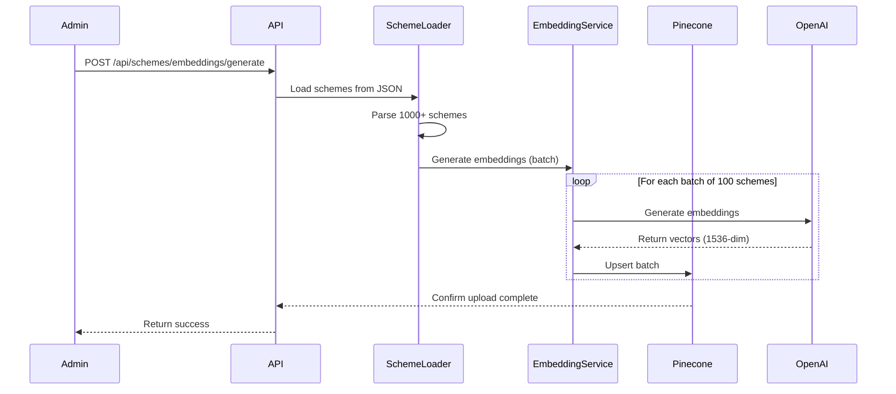
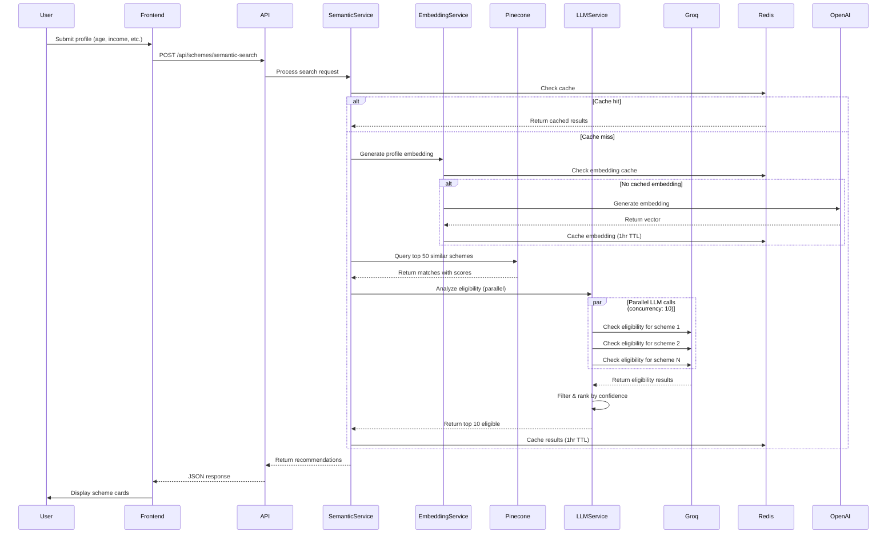

# Design Document: Semantic Scheme Search

## Overview

The Semantic Scheme Search feature enhances the existing government schemes platform by introducing AI-powered semantic search capabilities. Instead of relying solely on keyword matching and rule-based eligibility checks, this system uses vector embeddings and large language models to understand user profiles semantically and match them with relevant schemes.

### Key Capabilities

- **Vector-Based Similarity Search**: Converts scheme descriptions and user profiles into high-dimensional embeddings for semantic matching
- **LLM-Powered Eligibility Reasoning**: Uses Groq's LLaMA 3.1 70B model to analyze eligibility criteria with natural language understanding
- **Intelligent Ranking**: Combines semantic similarity scores with LLM confidence ratings to prioritize the most relevant schemes
- **Seamless Integration**: Extends the existing Schemes page with a "Smart Search" feature while maintaining backward compatibility

### Technology Stack

- **Embedding Generation**: OpenAI text-embedding-3-small (1536 dimensions) or Cohere embed-english-v3.0
- **Vector Database**: Pinecone (serverless or pod-based deployment)
- **LLM Reasoning**: Groq API with llama-3.1-70b-versatile model
- **Caching Layer**: Redis for profile embedding and result caching
- **Backend**: Node.js/TypeScript with Express
- **Frontend**: React with TypeScript, Material-UI components

### Design Goals

1. **Performance**: Complete end-to-end search within 15 seconds for 95% of requests
2. **Scalability**: Handle 1000+ schemes efficiently with batch processing and connection pooling
3. **Reliability**: Implement graceful fallbacks when external services are unavailable
4. **Maintainability**: Modular architecture with clear separation of concerns
5. **User Experience**: Provide fast, accurate, and explainable scheme recommendations

## Architecture

### System Architecture Diagram

```mermaid
graph TB
    subgraph "Frontend Layer"
        UI[Schemes Page UI]
        SmartSearch[Smart Search Component]
        ProfileForm[User Profile Form]
        Results[Results Display]
    end

    subgraph "API Layer"
        API[Express API Server]
        SemanticEndpoint[/api/schemes/semantic-search]
        EmbeddingEndpoint[/api/schemes/embeddings/generate]
        Auth[Authentication Middleware]
        RateLimit[Rate Limiter]
    end

    subgraph "Service Layer"
        SemanticService[Semantic Search Service]
        EmbeddingService[Embedding Generator Service]
        LLMService[LLM Ranker Service]
        SchemeLoader[Scheme Loader Service]
    end

    subgraph "Data Layer"
        Redis[(Redis Cache)]
        Pinecone[(Pinecone Vector DB)]
        Postgres[(PostgreSQL)]
        FileSystem[myscheme_full_1000.json]
    end

    subgraph "External APIs"
        OpenAI[OpenAI API]
        Cohere[Cohere API]
        Groq[Groq API]
    end

    UI --> SmartSearch
    SmartSearch --> ProfileForm
    ProfileForm --> SemanticEndpoint
    Results --> UI
    
    SemanticEndpoint --> Auth
    SemanticEndpoint --> RateLimit
    SemanticEndpoint --> SemanticService
    EmbeddingEndpoint --> Auth
    EmbeddingEndpoint --> EmbeddingService
    
    SemanticService --> EmbeddingService
    SemanticService --> LLMService
    SemanticService --> Redis
    
    EmbeddingService --> OpenAI
    EmbeddingService --> Cohere
    EmbeddingService --> Redis
    EmbeddingService --> Pinecone
    
    LLMService --> Groq
    
    SchemeLoader --> FileSystem
    SchemeLoader --> EmbeddingService
    SchemeLoader --> Pinecone
    
    SemanticService --> Pinecone
    SemanticService --> Postgres
```

### Data Flow

#### 1. Initial Setup Flow (One-time)



#### 2. Semantic Search Flow (Runtime)



## Components and Interfaces

### 1. Scheme Loader Service

**Responsibility**: Load and parse scheme data from myscheme_full_1000.json

**Location**: `src/services/semantic/scheme-loader.ts`

```typescript
interface SchemeDocument {
  id: string;
  name: string;
  description: string;
  eligibility_summary: string;
  benefits_summary: string;
  ministry: string;
  category: string;
  level: 'central' | 'state';
  state?: string;
  slug: string;
}

class SchemeLoaderService {
  async loadSchemes(): Promise<SchemeDocument[]>
  validateScheme(scheme: any): boolean
  getCompositeText(scheme: SchemeDocument): string
}
```

**Key Methods**:
- `loadSchemes()`: Reads JSON file, parses all schemes, validates required fields
- `validateScheme()`: Ensures scheme has name, description, eligibility_summary, benefits_summary
- `getCompositeText()`: Concatenates scheme fields into searchable text

### 2. Embedding Generator Service

**Responsibility**: Generate vector embeddings for schemes and user profiles

**Location**: `src/services/semantic/embedding-generator.ts`

```typescript
interface EmbeddingConfig {
  provider: 'openai' | 'cohere';
  model: string;
  dimensions: number;
  batchSize: number;
}

interface EmbeddingResult {
  vector: number[];
  dimensions: number;
  model: string;
}

class EmbeddingGeneratorService {
  async generateSchemeEmbedding(scheme: SchemeDocument): Promise<EmbeddingResult>
  async generateBatchEmbeddings(schemes: SchemeDocument[]): Promise<Map<string, EmbeddingResult>>
  async generateProfileEmbedding(profile: UserProfile): Promise<EmbeddingResult>
  formatProfileText(profile: UserProfile): string
  private async callEmbeddingAPI(texts: string[]): Promise<number[][]>
}
```

**Key Methods**:
- `generateSchemeEmbedding()`: Creates embedding for a single scheme
- `generateBatchEmbeddings()`: Processes schemes in batches of 100 for efficiency
- `generateProfileEmbedding()`: Converts user profile to natural language then to embedding
- `formatProfileText()`: Formats profile as "A [gender] person aged [age] from [state]..."

**Configuration**:
- OpenAI: text-embedding-3-small (1536 dimensions, $0.02/1M tokens)
- Cohere: embed-english-v3.0 (1024 dimensions, $0.10/1M tokens)
- Default: OpenAI for cost-effectiveness

### 3. Vector Store Service

**Responsibility**: Manage Pinecone index and vector operations

**Location**: `src/services/semantic/vector-store.ts`

```typescript
interface VectorMetadata {
  scheme_id: string;
  name: string;
  slug: string;
  ministry: string;
  category: string;
  level: string;
  state?: string;
}

interface VectorRecord {
  id: string;
  values: number[];
  metadata: VectorMetadata;
}

interface SearchResult {
  id: string;
  score: number;
  metadata: VectorMetadata;
}

class VectorStoreService {
  async initializeIndex(): Promise<void>
  async upsertVectors(vectors: VectorRecord[]): Promise<void>
  async search(queryVector: number[], topK: number): Promise<SearchResult[]>
  async deleteVector(id: string): Promise<void>
  async getIndexStats(): Promise<{ vectorCount: number; dimension: number }>
}
```

**Key Methods**:
- `initializeIndex()`: Creates "government-schemes" index if not exists, configures cosine similarity
- `upsertVectors()`: Batch uploads vectors in groups of 100 with retry logic
- `search()`: Queries Pinecone for top K similar vectors
- `getIndexStats()`: Returns index metadata for verification

**Pinecone Configuration**:
- Index name: "government-schemes" (configurable via env)
- Metric: cosine similarity
- Dimensions: 1536 (OpenAI) or 1024 (Cohere)
- Deployment: Serverless (default) or pod-based

### 4. LLM Ranker Service

**Responsibility**: Use Groq API to analyze eligibility and rank schemes

**Location**: `src/services/semantic/llm-ranker.ts`

```typescript
interface EligibilityAnalysis {
  eligible: boolean;
  confidence: number; // 0-1
  reasoning: string;
}

interface RankedScheme {
  schemeId: string;
  scheme: SchemeDocument;
  similarityScore: number;
  eligibility: EligibilityAnalysis;
}

class LLMRankerService {
  async analyzeEligibility(
    profile: UserProfile,
    scheme: SchemeDocument
  ): Promise<EligibilityAnalysis>
  
  async batchAnalyze(
    profile: UserProfile,
    schemes: SearchResult[]
  ): Promise<RankedScheme[]>
  
  private buildPrompt(profile: UserProfile, scheme: SchemeDocument): string
  private parseResponse(response: string): EligibilityAnalysis
}
```

**Key Methods**:
- `analyzeEligibility()`: Sends profile + scheme to Groq, parses structured response
- `batchAnalyze()`: Processes up to 50 schemes in parallel (concurrency limit: 10)
- `buildPrompt()`: Creates prompt with profile details and eligibility criteria
- `parseResponse()`: Extracts eligible, confidence, reasoning from LLM response

**Groq Configuration**:
- Model: llama-3.1-70b-versatile
- Temperature: 0.1 (deterministic)
- Max tokens: 500
- Timeout: 10 seconds
- Retry: Exponential backoff (3 attempts)

**Prompt Template**:
```
Analyze if the following user is eligible for this government scheme.

User Profile:
- Age: {age}
- Gender: {gender}
- Income: {income}
- Caste: {caste}
- State: {state}

Scheme: {scheme_name}
Eligibility Criteria: {eligibility_summary}

Respond in JSON format:
{
  "eligible": boolean,
  "confidence": number (0-1),
  "reasoning": string
}
```

### 5. Semantic Search Service

**Responsibility**: Orchestrate the complete semantic search workflow

**Location**: `src/services/semantic/semantic-search.ts`

```typescript
interface SemanticSearchRequest {
  age: number;
  income: number;
  caste: string;
  gender: string;
  state: string;
}

interface SchemeRecommendation {
  schemeId: string;
  name: string;
  slug: string;
  description: string;
  category: string;
  level: string;
  ministry: string;
  similarityScore: number;
  confidence: number;
  reasoning: string;
  estimatedBenefit?: number;
}

class SemanticSearchService {
  async search(request: SemanticSearchRequest): Promise<SchemeRecommendation[]>
  private async getCachedResults(cacheKey: string): Promise<SchemeRecommendation[] | null>
  private async cacheResults(cacheKey: string, results: SchemeRecommendation[]): Promise<void>
  private generateCacheKey(request: SemanticSearchRequest): string
}
```

**Key Methods**:
- `search()`: Main entry point, orchestrates embedding → vector search → LLM ranking
- `getCachedResults()`: Checks Redis for previously computed results
- `cacheResults()`: Stores results in Redis with 1-hour TTL
- `generateCacheKey()`: Creates deterministic key from profile attributes

**Search Algorithm**:
1. Generate cache key from profile
2. Check Redis cache (return if hit)
3. Generate profile embedding (with embedding cache)
4. Query Pinecone for top 50 similar schemes
5. Parallel LLM analysis for eligibility (concurrency: 10)
6. Filter ineligible schemes
7. Sort by confidence score (descending)
8. Return top 10 schemes
9. Cache results

### 6. API Endpoints

**Location**: `src/routes/semantic-search.ts`

#### POST /api/schemes/semantic-search

**Request Body**:
```typescript
{
  age: number;          // 0-120
  income: number;       // Non-negative
  caste: string;        // General, OBC, SC, ST, Other
  gender: string;       // Male, Female, Other
  state: string;        // Indian state/UT
}
```

**Response** (200 OK):
```typescript
{
  success: true;
  data: {
    totalResults: number;
    processingTime: number;
    recommendations: SchemeRecommendation[];
  }
}
```

**Error Responses**:
- 400: Invalid profile data
- 500: Internal processing error
- 503: External service unavailable

#### POST /api/schemes/embeddings/generate (Admin)

**Authentication**: Required (admin role)

**Request Body**:
```typescript
{
  forceRegenerate?: boolean;  // Default: false
}
```

**Response** (200 OK):
```typescript
{
  success: true;
  data: {
    totalSchemes: number;
    embeddingsGenerated: number;
    vectorsUploaded: number;
    duration: number;
  }
}
```

## Data Models

### Pinecone Vector Schema

```typescript
{
  id: string;                    // scheme_id from JSON
  values: number[];              // 1536-dim embedding vector
  metadata: {
    scheme_id: string;
    name: string;
    slug: string;
    ministry: string;
    category: string;
    level: string;
    state?: string;
  }
}
```

### Redis Cache Schema

**Profile Embedding Cache**:
- Key: `embedding:profile:{hash}`
- Value: JSON stringified EmbeddingResult
- TTL: 1 hour

**Search Results Cache**:
- Key: `search:results:{hash}`
- Value: JSON stringified SchemeRecommendation[]
- TTL: 1 hour

**Hash Function**: SHA-256 of sorted profile attributes

### User Profile Type Extension

```typescript
interface SemanticSearchProfile {
  age: number;
  income: number;
  caste: 'General' | 'OBC' | 'SC' | 'ST' | 'Other';
  gender: 'Male' | 'Female' | 'Other';
  state: string;
}
```

## Frontend Integration

### Component Structure

```
Schemes.tsx (existing)
├── SearchBar (existing)
├── FilterPanel (existing)
└── SmartSearchPanel (new)
    ├── ProfileInputForm (new)
    │   ├── AgeInput
    │   ├── IncomeInput
    │   ├── CasteSelect
    │   ├── GenderSelect
    │   └── StateSelect
    ├── LoadingIndicator (new)
    └── ResultsDisplay (reuse SchemeCardGrid)
```

### New Components

#### SmartSearchPanel.tsx

```typescript
interface SmartSearchPanelProps {
  onSearch: (profile: SemanticSearchProfile) => void;
  loading: boolean;
  error?: string;
}

const SmartSearchPanel: React.FC<SmartSearchPanelProps> = ({
  onSearch,
  loading,
  error
}) => {
  // Renders profile form and handles submission
}
```

#### ProfileInputForm.tsx

```typescript
interface ProfileInputFormProps {
  onSubmit: (profile: SemanticSearchProfile) => void;
  disabled: boolean;
}

const ProfileInputForm: React.FC<ProfileInputFormProps> = ({
  onSubmit,
  disabled
}) => {
  // Form validation and submission
}
```

### Integration with Schemes.tsx

```typescript
// Add state for semantic search mode
const [searchMode, setSearchMode] = useState<'traditional' | 'semantic'>('traditional');
const [semanticResults, setSemanticResults] = useState<SchemeRecommendation[]>([]);

// Add handler for semantic search
const handleSemanticSearch = async (profile: SemanticSearchProfile) => {
  try {
    const response = await apiService.post('/api/schemes/semantic-search', profile);
    setSemanticResults(response.data.recommendations);
    setSearchMode('semantic');
  } catch (error) {
    // Handle error
  }
};

// Render appropriate view based on mode
{searchMode === 'semantic' ? (
  <SchemeCardGrid schemes={semanticResults} />
) : (
  <SchemeCardGrid schemes={filteredSchemes} />
)}
```

### API Service Extension

```typescript
// frontend/src/services/apiService.ts

export const semanticSearch = async (
  profile: SemanticSearchProfile
): Promise<SchemeRecommendation[]> => {
  const response = await api.post('/api/schemes/semantic-search', profile);
  return response.data.recommendations;
};
```


## Correctness Properties

*A property is a characteristic or behavior that should hold true across all valid executions of a system—essentially, a formal statement about what the system should do. Properties serve as the bridge between human-readable specifications and machine-verifiable correctness guarantees.*

### Property 1: Scheme Parsing Completeness

*For any* valid JSON array of scheme objects, parsing should successfully convert all records into Scheme_Document objects with the correct structure.

**Validates: Requirements 1.2, 1.5**

### Property 2: Required Field Validation

*For any* scheme document, validation should correctly identify whether all required fields (name, description, eligibility_summary, benefits_summary) are present.

**Validates: Requirements 1.4**

### Pr