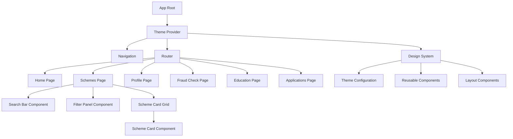
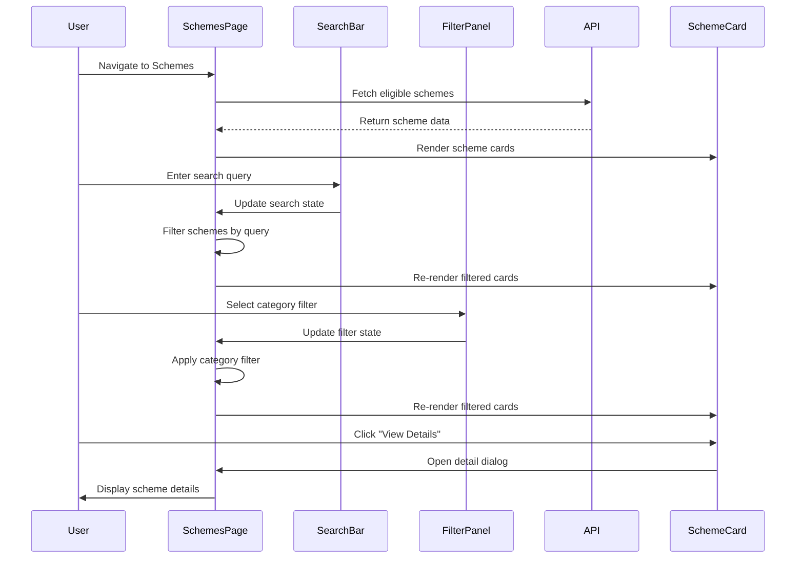

# Design Document: UI Redesign Modern

## Overview

This design document outlines a comprehensive UI redesign for the Rural Digital Rights AI Companion application. The redesign transforms the basic list-based interface into a modern, professional, and user-friendly experience with enhanced search, filtering, and visual hierarchy. The design focuses on Material-UI v5 components, a cohesive design system, and responsive layouts optimized for rural users accessing government schemes, fraud detection, and financial education.

The redesign addresses current issues including basic scheme display, lack of search/filtering, inconsistent styling, and poor visual hierarchy. The solution implements a card-based design system with modern colors, proper spacing, responsive grids, loading states, and professional iconography.

## Architecture



## Main Algorithm/Workflow




## Components and Interfaces

### Component 1: Theme Configuration

**Purpose**: Centralized theme configuration for consistent design system across the application

**Interface**:
```typescript
interface ThemeConfig {
  palette: {
    primary: { main: string; light: string; dark: string };
    secondary: { main: string; light: string; dark: string };
    success: { main: string };
    warning: { main: string };
    error: { main: string };
    background: { default: string; paper: string };
    text: { primary: string; secondary: string };
  };
  typography: {
    fontFamily: string;
    h1: TypographyStyle;
    h2: TypographyStyle;
    h3: TypographyStyle;
    h4: TypographyStyle;
    h5: TypographyStyle;
    h6: TypographyStyle;
    body1: TypographyStyle;
    body2: TypographyStyle;
  };
  spacing: (factor: number) => number;
  shape: { borderRadius: number };
  shadows: string[];
}
```

**Responsibilities**:
- Define color palette with primary (#2563eb), secondary (#10b981), and semantic colors
- Configure typography with Inter/Roboto font family and size hierarchy
- Set spacing scale based on 4px base unit (8px, 16px, 24px, 32px, 48px)
- Define border radius (8px for cards, 4px for inputs)
- Configure elevation/shadow system for depth

### Component 2: SearchBar Component

**Purpose**: Provides search functionality for filtering schemes by name or description

**Interface**:
```typescript
interface SearchBarProps {
  value: string;
  onChange: (value: string) => void;
  placeholder?: string;
  debounceMs?: number;
}

const SearchBar: React.FC<SearchBarProps>
```

**Responsibilities**:
- Render Material-UI TextField with search icon
- Implement debounced search to avoid excessive filtering
- Provide clear button to reset search
- Emit onChange events with search query
- Display loading indicator during search


### Component 3: FilterPanel Component

**Purpose**: Provides category and sorting filters for scheme recommendations

**Interface**:
```typescript
interface FilterPanelProps {
  categories: string[];
  selectedCategories: string[];
  onCategoryChange: (categories: string[]) => void;
  sortBy: SortOption;
  onSortChange: (sort: SortOption) => void;
  schemeLevel?: 'all' | 'central' | 'state';
  onLevelChange?: (level: string) => void;
}

type SortOption = 'relevance' | 'benefit' | 'eligibility';

const FilterPanel: React.FC<FilterPanelProps>
```

**Responsibilities**:
- Display category chips with multi-select capability
- Provide sort dropdown (relevance, benefit amount, eligibility match)
- Filter by scheme level (Central/State)
- Show active filter count badge
- Emit filter change events
- Responsive collapse on mobile

### Component 4: SchemeCard Component

**Purpose**: Displays individual scheme information in a card format with visual hierarchy

**Interface**:
```typescript
interface SchemeCardProps {
  scheme: SchemeRecommendation;
  onViewDetails: (scheme: SchemeRecommendation) => void;
  onApply: (schemeId: string) => void;
  elevation?: number;
}

interface SchemeRecommendation {
  scheme: {
    schemeId: string;
    officialName: string;
    shortDescription: string;
    category: string;
    level: 'Central' | 'State';
    officialWebsite?: string;
    helplineNumber?: string;
  };
  eligibility: {
    eligible: boolean;
    confidence: number;
    explanation: string;
  };
  estimatedBenefit: number;
  personalizedExplanation: string;
}

const SchemeCard: React.FC<SchemeCardProps>
```

**Responsibilities**:
- Render card with scheme name, description, and metadata
- Display category and level badges with appropriate colors
- Show estimated benefit prominently with currency formatting
- Display eligibility confidence score with visual indicator
- Provide "View Details" and "Apply Now" action buttons
- Implement hover effects and transitions
- Support responsive layout


### Component 5: SchemeDetailDialog Component

**Purpose**: Displays comprehensive scheme information in a modal dialog

**Interface**:
```typescript
interface SchemeDetailDialogProps {
  open: boolean;
  scheme: SchemeRecommendation | null;
  onClose: () => void;
  onApply: (schemeId: string) => void;
}

const SchemeDetailDialog: React.FC<SchemeDetailDialogProps>
```

**Responsibilities**:
- Render full-screen dialog on mobile, modal on desktop
- Display complete scheme details with sections
- Show eligibility explanation with visual indicators
- Provide links to official website and helpline
- Include "Apply Now" call-to-action button
- Support keyboard navigation and accessibility

### Component 6: LoadingSkeleton Component

**Purpose**: Provides skeleton loading states for better perceived performance

**Interface**:
```typescript
interface LoadingSkeletonProps {
  variant: 'card' | 'list' | 'text';
  count?: number;
  height?: number | string;
}

const LoadingSkeleton: React.FC<LoadingSkeletonProps>
```

**Responsibilities**:
- Render Material-UI Skeleton components
- Match layout of actual content
- Animate smoothly during loading
- Support different variants (card grid, list, text)
- Configurable count and dimensions

### Component 7: EmptyState Component

**Purpose**: Displays helpful messages when no data is available

**Interface**:
```typescript
interface EmptyStateProps {
  icon: React.ReactNode;
  title: string;
  description: string;
  action?: {
    label: string;
    onClick: () => void;
  };
}

const EmptyState: React.FC<EmptyStateProps>
```

**Responsibilities**:
- Display centered icon, title, and description
- Provide optional call-to-action button
- Use appropriate colors and spacing
- Support different empty state scenarios


## Data Models

### Model 1: Theme Configuration

```typescript
interface ThemeConfiguration {
  colors: {
    primary: string;        // #2563eb (Modern blue)
    secondary: string;      // #10b981 (Accent green)
    success: string;        // #22c55e
    warning: string;        // #f59e0b
    error: string;          // #ef4444
    neutral: {
      50: string;           // #f9fafb
      100: string;          // #f3f4f6
      200: string;          // #e5e7eb
      300: string;          // #d1d5db
      400: string;          // #9ca3af
      500: string;          // #6b7280
      600: string;          // #4b5563
      700: string;          // #374151
      800: string;          // #1f2937
      900: string;          // #111827
    };
  };
  spacing: {
    xs: number;             // 4px
    sm: number;             // 8px
    md: number;             // 16px
    lg: number;             // 24px
    xl: number;             // 32px
    xxl: number;            // 48px
  };
  borderRadius: {
    small: number;          // 4px
    medium: number;         // 8px
    large: number;          // 12px
  };
  shadows: {
    sm: string;
    md: string;
    lg: string;
    xl: string;
  };
}
```

**Validation Rules**:
- All color values must be valid hex codes
- Spacing values must be multiples of 4
- Border radius values must be positive numbers
- Shadow values must be valid CSS box-shadow strings

### Model 2: Filter State

```typescript
interface FilterState {
  searchQuery: string;
  selectedCategories: string[];
  sortBy: 'relevance' | 'benefit' | 'eligibility';
  schemeLevel: 'all' | 'central' | 'state';
}
```

**Validation Rules**:
- searchQuery can be empty or any string
- selectedCategories must be array of valid category strings
- sortBy must be one of the three allowed values
- schemeLevel must be one of the three allowed values


### Model 3: Scheme Categories

```typescript
const SCHEME_CATEGORIES = [
  'agriculture',
  'education',
  'health',
  'housing',
  'employment',
  'pension',
  'women_welfare',
  'child_welfare',
  'disability',
  'financial_inclusion'
] as const;

type SchemeCategory = typeof SCHEME_CATEGORIES[number];

interface CategoryConfig {
  id: SchemeCategory;
  label: string;
  icon: React.ComponentType;
  color: string;
}
```

**Validation Rules**:
- Category ID must be one of the predefined constants
- Label must be non-empty string
- Icon must be valid React component
- Color must be valid CSS color value

## Key Functions with Formal Specifications

### Function 1: filterSchemes()

```typescript
function filterSchemes(
  schemes: SchemeRecommendation[],
  filters: FilterState
): SchemeRecommendation[]
```

**Preconditions:**
- `schemes` is a valid array (may be empty)
- `filters` is a valid FilterState object
- `filters.searchQuery` is a string (may be empty)
- `filters.selectedCategories` is an array of valid category strings

**Postconditions:**
- Returns filtered array of schemes
- Returned array length ≤ input array length
- All returned schemes match filter criteria
- Original schemes array is not mutated
- Empty filters return all schemes

**Loop Invariants:**
- All previously processed schemes either match filters or are excluded
- Filter state remains constant during iteration


### Function 2: sortSchemes()

```typescript
function sortSchemes(
  schemes: SchemeRecommendation[],
  sortBy: SortOption
): SchemeRecommendation[]
```

**Preconditions:**
- `schemes` is a valid array of SchemeRecommendation objects
- `sortBy` is one of: 'relevance', 'benefit', 'eligibility'
- All schemes have valid eligibility.confidence values (0-1)
- All schemes have valid estimatedBenefit values (≥0)

**Postconditions:**
- Returns sorted array of schemes
- Returned array has same length as input
- Sorting is stable (equal elements maintain relative order)
- Original schemes array is not mutated
- Sort order matches the specified sortBy option

**Loop Invariants:**
- All elements before current position are in correct sorted order
- No elements are lost or duplicated during sorting

### Function 3: debounceSearch()

```typescript
function debounceSearch(
  callback: (query: string) => void,
  delay: number
): (query: string) => void
```

**Preconditions:**
- `callback` is a valid function
- `delay` is a positive number (milliseconds)
- `delay` ≥ 0

**Postconditions:**
- Returns debounced function
- Callback is invoked at most once per delay period
- Latest query value is used when callback executes
- Previous pending calls are cancelled
- No memory leaks from uncancelled timers

**Loop Invariants:** N/A (no loops)


### Function 4: calculateEligibilityColor()

```typescript
function calculateEligibilityColor(
  confidence: number,
  theme: Theme
): string
```

**Preconditions:**
- `confidence` is a number between 0 and 1 (inclusive)
- `theme` is a valid Material-UI Theme object
- `theme.palette` contains success, warning, and error colors

**Postconditions:**
- Returns valid CSS color string
- Color corresponds to confidence level:
  - confidence ≥ 0.8 → success color (green)
  - 0.5 ≤ confidence < 0.8 → warning color (orange)
  - confidence < 0.5 → error color (red)
- Return value is always a valid color from theme

**Loop Invariants:** N/A (no loops)

## Algorithmic Pseudocode

### Main Processing Algorithm

```pascal
ALGORITHM renderSchemesPage(userId)
INPUT: userId of type String
OUTPUT: rendered React component

BEGIN
  ASSERT userId IS NOT NULL AND userId IS NOT EMPTY
  
  // Step 1: Initialize state
  schemes ← EMPTY_ARRAY
  filteredSchemes ← EMPTY_ARRAY
  loading ← TRUE
  filters ← {
    searchQuery: "",
    selectedCategories: [],
    sortBy: "relevance",
    schemeLevel: "all"
  }
  
  // Step 2: Fetch schemes from API
  TRY
    response ← API.fetchEligibleSchemes(userId)
    ASSERT response.success = TRUE
    schemes ← response.data.recommendations
    filteredSchemes ← schemes
    loading ← FALSE
  CATCH error
    DISPLAY_ERROR(error.message)
    loading ← FALSE
  END TRY
  
  // Step 3: Apply filters when filter state changes
  WHEN filters CHANGES DO
    ASSERT schemes IS VALID_ARRAY
    
    filteredSchemes ← filterSchemes(schemes, filters)
    filteredSchemes ← sortSchemes(filteredSchemes, filters.sortBy)
    
    ASSERT filteredSchemes.length ≤ schemes.length
  END WHEN
  
  // Step 4: Render UI
  IF loading = TRUE THEN
    RENDER LoadingSkeleton(variant: "card", count: 6)
  ELSE IF filteredSchemes.length = 0 THEN
    RENDER EmptyState(
      title: "No schemes found",
      description: "Try adjusting your filters"
    )
  ELSE
    RENDER SchemeCardGrid(schemes: filteredSchemes)
  END IF
  
  RETURN rendered_component
END
```

**Preconditions:**
- userId is a valid non-empty string
- API endpoint is accessible
- User profile exists in database

**Postconditions:**
- Component is rendered with appropriate state
- Loading state is properly managed
- Filtered schemes are displayed correctly
- Error states are handled gracefully

**Loop Invariants:**
- Filter state remains consistent during render cycle
- Schemes array is never mutated directly


### Filtering Algorithm

```pascal
ALGORITHM filterSchemes(schemes, filters)
INPUT: schemes of type Array<SchemeRecommendation>
INPUT: filters of type FilterState
OUTPUT: filteredSchemes of type Array<SchemeRecommendation>

BEGIN
  ASSERT schemes IS VALID_ARRAY
  ASSERT filters IS VALID_OBJECT
  
  filteredSchemes ← schemes
  
  // Filter by search query
  IF filters.searchQuery ≠ "" THEN
    query ← LOWERCASE(filters.searchQuery)
    filteredSchemes ← FILTER filteredSchemes WHERE
      LOWERCASE(scheme.officialName) CONTAINS query OR
      LOWERCASE(scheme.shortDescription) CONTAINS query
  END IF
  
  // Filter by categories
  IF filters.selectedCategories.length > 0 THEN
    filteredSchemes ← FILTER filteredSchemes WHERE
      scheme.category IN filters.selectedCategories
  END IF
  
  // Filter by scheme level
  IF filters.schemeLevel ≠ "all" THEN
    level ← UPPERCASE(filters.schemeLevel)
    filteredSchemes ← FILTER filteredSchemes WHERE
      scheme.level = level
  END IF
  
  ASSERT filteredSchemes.length ≤ schemes.length
  ASSERT ALL items IN filteredSchemes ARE IN schemes
  
  RETURN filteredSchemes
END
```

**Preconditions:**
- schemes is a valid array (may be empty)
- filters is a valid FilterState object
- All schemes have required properties (officialName, shortDescription, category, level)

**Postconditions:**
- Returns filtered array
- Returned array length ≤ input array length
- All returned schemes match all filter criteria
- Original schemes array is not mutated

**Loop Invariants:**
- Each filter operation maintains array validity
- No schemes are duplicated in result


### Sorting Algorithm

```pascal
ALGORITHM sortSchemes(schemes, sortBy)
INPUT: schemes of type Array<SchemeRecommendation>
INPUT: sortBy of type SortOption
OUTPUT: sortedSchemes of type Array<SchemeRecommendation>

BEGIN
  ASSERT schemes IS VALID_ARRAY
  ASSERT sortBy IN ["relevance", "benefit", "eligibility"]
  
  sortedSchemes ← COPY(schemes)
  
  IF sortBy = "relevance" THEN
    // Sort by eligibility confidence (descending)
    SORT sortedSchemes BY scheme.eligibility.confidence DESC
    
  ELSE IF sortBy = "benefit" THEN
    // Sort by estimated benefit (descending)
    SORT sortedSchemes BY scheme.estimatedBenefit DESC
    
  ELSE IF sortBy = "eligibility" THEN
    // Sort by eligibility confidence (descending)
    SORT sortedSchemes BY scheme.eligibility.confidence DESC
  END IF
  
  ASSERT sortedSchemes.length = schemes.length
  ASSERT ALL items IN sortedSchemes ARE IN schemes
  
  RETURN sortedSchemes
END
```

**Preconditions:**
- schemes is a valid array of SchemeRecommendation objects
- sortBy is one of the valid SortOption values
- All schemes have valid eligibility.confidence values (0-1)
- All schemes have valid estimatedBenefit values (≥0)

**Postconditions:**
- Returns sorted array with same length as input
- Sorting is stable (equal elements maintain relative order)
- Original schemes array is not mutated
- Sort order matches the specified sortBy option

**Loop Invariants:**
- During sort operation, all compared elements maintain their data integrity
- No elements are lost or duplicated


## Example Usage

### Example 1: Basic Schemes Page Rendering

```typescript
// SchemesPage.tsx
import React, { useState, useEffect } from 'react';
import { Container, Box } from '@mui/material';
import { SearchBar } from '../components/SearchBar';
import { FilterPanel } from '../components/FilterPanel';
import { SchemeCardGrid } from '../components/SchemeCardGrid';
import { LoadingSkeleton } from '../components/LoadingSkeleton';
import { EmptyState } from '../components/EmptyState';

const SchemesPage: React.FC = () => {
  const [schemes, setSchemes] = useState<SchemeRecommendation[]>([]);
  const [loading, setLoading] = useState(true);
  const [filters, setFilters] = useState<FilterState>({
    searchQuery: '',
    selectedCategories: [],
    sortBy: 'relevance',
    schemeLevel: 'all'
  });

  useEffect(() => {
    loadSchemes();
  }, []);

  const filteredSchemes = useMemo(() => {
    let result = filterSchemes(schemes, filters);
    result = sortSchemes(result, filters.sortBy);
    return result;
  }, [schemes, filters]);

  if (loading) {
    return <LoadingSkeleton variant="card" count={6} />;
  }

  return (
    <Container maxWidth="lg">
      <SearchBar
        value={filters.searchQuery}
        onChange={(query) => setFilters({ ...filters, searchQuery: query })}
      />
      <FilterPanel
        categories={SCHEME_CATEGORIES}
        selectedCategories={filters.selectedCategories}
        onCategoryChange={(cats) => setFilters({ ...filters, selectedCategories: cats })}
        sortBy={filters.sortBy}
        onSortChange={(sort) => setFilters({ ...filters, sortBy: sort })}
      />
      {filteredSchemes.length === 0 ? (
        <EmptyState
          title="No schemes found"
          description="Try adjusting your filters"
        />
      ) : (
        <SchemeCardGrid schemes={filteredSchemes} />
      )}
    </Container>
  );
};
```


### Example 2: Theme Configuration

```typescript
// theme.ts
import { createTheme } from '@mui/material/styles';

export const theme = createTheme({
  palette: {
    primary: {
      main: '#2563eb',
      light: '#60a5fa',
      dark: '#1e40af',
    },
    secondary: {
      main: '#10b981',
      light: '#34d399',
      dark: '#059669',
    },
    success: {
      main: '#22c55e',
    },
    warning: {
      main: '#f59e0b',
    },
    error: {
      main: '#ef4444',
    },
    background: {
      default: '#f9fafb',
      paper: '#ffffff',
    },
    text: {
      primary: '#111827',
      secondary: '#6b7280',
    },
  },
  typography: {
    fontFamily: '"Inter", "Roboto", "Helvetica", "Arial", sans-serif',
    h1: { fontSize: '2.5rem', fontWeight: 700, lineHeight: 1.2 },
    h2: { fontSize: '2rem', fontWeight: 700, lineHeight: 1.3 },
    h3: { fontSize: '1.75rem', fontWeight: 600, lineHeight: 1.3 },
    h4: { fontSize: '1.5rem', fontWeight: 600, lineHeight: 1.4 },
    h5: { fontSize: '1.25rem', fontWeight: 600, lineHeight: 1.4 },
    h6: { fontSize: '1rem', fontWeight: 600, lineHeight: 1.5 },
    body1: { fontSize: '1rem', lineHeight: 1.5 },
    body2: { fontSize: '0.875rem', lineHeight: 1.5 },
  },
  spacing: 4, // Base unit: 4px
  shape: {
    borderRadius: 8,
  },
  shadows: [
    'none',
    '0 1px 2px 0 rgba(0, 0, 0, 0.05)',
    '0 1px 3px 0 rgba(0, 0, 0, 0.1), 0 1px 2px 0 rgba(0, 0, 0, 0.06)',
    '0 4px 6px -1px rgba(0, 0, 0, 0.1), 0 2px 4px -1px rgba(0, 0, 0, 0.06)',
    '0 10px 15px -3px rgba(0, 0, 0, 0.1), 0 4px 6px -2px rgba(0, 0, 0, 0.05)',
    '0 20px 25px -5px rgba(0, 0, 0, 0.1), 0 10px 10px -5px rgba(0, 0, 0, 0.04)',
    // ... additional shadows
  ],
});
```


### Example 3: SchemeCard Component Implementation

```typescript
// SchemeCard.tsx
import React from 'react';
import {
  Card,
  CardContent,
  CardActions,
  Typography,
  Chip,
  Button,
  Box,
} from '@mui/material';
import AccountBalanceIcon from '@mui/icons-material/AccountBalance';
import CheckCircleIcon from '@mui/icons-material/CheckCircle';

export const SchemeCard: React.FC<SchemeCardProps> = ({
  scheme,
  onViewDetails,
  onApply,
  elevation = 2,
}) => {
  const confidencePercent = Math.round(scheme.eligibility.confidence * 100);
  const confidenceColor = calculateEligibilityColor(
    scheme.eligibility.confidence,
    theme
  );

  return (
    <Card
      elevation={elevation}
      sx={{
        height: '100%',
        display: 'flex',
        flexDirection: 'column',
        transition: 'all 0.3s ease',
        '&:hover': {
          transform: 'translateY(-4px)',
          boxShadow: 6,
        },
      }}
    >
      <CardContent sx={{ flexGrow: 1 }}>
        <Box sx={{ display: 'flex', alignItems: 'center', mb: 2 }}>
          <AccountBalanceIcon color="primary" sx={{ mr: 1 }} />
          <Typography variant="h6" component="h2">
            {scheme.scheme.officialName}
          </Typography>
        </Box>

        <Box sx={{ mb: 2 }}>
          <Chip
            label={scheme.scheme.level}
            size="small"
            color="primary"
            sx={{ mr: 1 }}
          />
          <Chip
            label={scheme.scheme.category}
            size="small"
            variant="outlined"
          />
        </Box>

        <Typography variant="body2" color="text.secondary" paragraph>
          {scheme.scheme.shortDescription}
        </Typography>

        {scheme.estimatedBenefit > 0 && (
          <Box sx={{ mb: 2 }}>
            <Typography variant="h5" color="success.main">
              ₹{scheme.estimatedBenefit.toLocaleString()}
            </Typography>
            <Typography variant="caption" color="text.secondary">
              Estimated Benefit
            </Typography>
          </Box>
        )}

        {scheme.eligibility.eligible && (
          <Box sx={{ display: 'flex', alignItems: 'center' }}>
            <CheckCircleIcon sx={{ mr: 1, color: confidenceColor }} />
            <Typography variant="body2" sx={{ color: confidenceColor }}>
              {confidencePercent}% Match
            </Typography>
          </Box>
        )}
      </CardContent>

      <CardActions sx={{ p: 2, pt: 0 }}>
        <Button size="small" onClick={() => onViewDetails(scheme)}>
          View Details
        </Button>
        <Button
          size="small"
          variant="contained"
          color="primary"
          onClick={() => onApply(scheme.scheme.schemeId)}
        >
          Apply Now
        </Button>
      </CardActions>
    </Card>
  );
};
```


## Correctness Properties

*A property is a characteristic or behavior that should hold true across all valid executions of a system—essentially, a formal statement about what the system should do. Properties serve as the bridge between human-readable specifications and machine-verifiable correctness guarantees.*

### Property 1: Filter Subset Preservation

*For any* list of schemes and any filter state, the filtered result should contain only schemes from the original list and never increase the total count.

**Validates: Requirements 11.1, 11.4**

### Property 2: Empty Filter Identity

*For any* list of schemes, when no filters are active (empty search query, no selected categories, scheme level set to "all"), the filtered result should be identical to the original list.

**Validates: Requirements 3.4, 4.3, 4.6, 11.5**

### Property 3: Search Case Insensitivity

*For any* list of schemes and any search query, filtering with the query in lowercase, uppercase, or mixed case should produce identical results.

**Validates: Requirements 3.2, 11.3**

### Property 4: Search Field Matching

*For any* list of schemes and any search query, the filtered results should include all schemes where either the official name or short description contains the query (case-insensitive).

**Validates: Requirements 3.2, 11.2**

### Property 5: Category Filter Conjunction

*For any* list of schemes and any set of selected categories, the filtered results should include only schemes whose category is in the selected set.

**Validates: Requirements 4.2**

### Property 6: Level Filter Matching

*For any* list of schemes and any selected level (central or state), the filtered results should include only schemes matching that level.

**Validates: Requirements 4.5**

### Property 7: Multi-Filter AND Logic

*For any* list of schemes and any combination of active filters (search, categories, level), a scheme should appear in the results only if it matches ALL filter criteria.

**Validates: Requirements 11.1**

### Property 8: Sort Preserves All Elements

*For any* list of schemes and any sort option (relevance, benefit, eligibility), the sorted result should contain exactly the same schemes as the input with no additions or removals.

**Validates: Requirements 5.2, 5.3, 5.4**

### Property 9: Sort Order Correctness

*For any* list of schemes, when sorted by "benefit", each scheme's estimated benefit should be greater than or equal to the next scheme's benefit (descending order).

**Validates: Requirements 5.3**

### Property 10: Sort Stability

*For any* list of schemes with equal sort values, sorting should maintain the relative order of those equal elements.

**Validates: Requirements 5.5**

### Property 11: Filter Immutability

*For any* list of schemes and any filter state, applying filters should not mutate the original schemes array.

**Validates: Requirements 11.4**

### Property 12: SchemeCard Required Fields

*For any* scheme, the rendered SchemeCard should contain the official name, level badge, category badge, and short description.

**Validates: Requirements 2.2, 2.3, 2.4, 2.5**

### Property 13: Conditional Benefit Display

*For any* scheme with estimated benefit greater than zero, the rendered SchemeCard should display the benefit amount with currency formatting.

**Validates: Requirements 2.6**

### Property 14: Conditional Eligibility Display

*For any* scheme where the user is eligible, the rendered SchemeCard should display the eligibility confidence as a percentage with a colored indicator.

**Validates: Requirements 2.7, 10.5**

### Property 15: Confidence Percentage Rounding

*For any* eligibility confidence value between 0 and 1, the displayed percentage should be the confidence multiplied by 100 and rounded to the nearest integer.

**Validates: Requirements 10.4**

### Property 16: Dialog Content Completeness

*For any* scheme, when the detail dialog is opened, it should display the official name, description, category, level, and eligibility explanation.

**Validates: Requirements 6.2, 6.3**

### Property 17: Conditional Website Link

*For any* scheme with an official website field, the detail dialog should display a clickable link to that website.

**Validates: Requirements 6.4**

### Property 18: Conditional Helpline Display

*For any* scheme with a helpline number field, the detail dialog should display that helpline number.

**Validates: Requirements 6.5**

### Property 19: Empty State Trigger

*For any* filter state that results in zero matching schemes, the system should display the EmptyState component instead of an empty grid.

**Validates: Requirements 8.1**

### Property 20: Clear Filters Button Presence

*For any* filter state where at least one filter is active (non-empty search, selected categories, or non-"all" level) and zero schemes match, the EmptyState should provide a "Clear Filters" button.

**Validates: Requirements 8.4**

### Property 21: Active Filter Count

*For any* filter state, the displayed active filter count should equal the number of active filters (non-empty search counts as 1, each selected category counts as 1, non-"all" level counts as 1).

**Validates: Requirements 4.7**

### Property 22: Spacing Scale Consistency

*For any* spacing multiplier n, the theme spacing function should return n multiplied by 4 pixels.

**Validates: Requirements 1.4**

### Property 23: Input Sanitization

*For any* user-generated HTML content, the system should sanitize it before rendering to prevent XSS attacks.

**Validates: Requirements 15.1**

### Property 24: API Response Validation

*For any* API response, the system should validate that the data structure matches the expected SchemeRecommendation type before rendering.

**Validates: Requirements 15.2**

### Property 25: Invalid Filter Sanitization

*For any* filter state containing invalid values, the system should reset those invalid values to defaults without throwing errors.

**Validates: Requirements 13.4**

### Property 26: Error Log Privacy

*For any* error that is logged, the log message should not contain sensitive user information such as full names, addresses, or identification numbers.

**Validates: Requirements 15.5**

### Property 27: ARIA Label Presence

*For any* interactive element (buttons, inputs, links), the element should have an appropriate ARIA label or accessible name.

**Validates: Requirements 14.1**

### Property 28: Color Contrast Compliance

*For any* text element and its background, the color contrast ratio should be at least 4.5:1.

**Validates: Requirements 14.5**

### Property 29: Focus Indicator Presence

*For any* interactive element, the element should have visible focus styles defined in CSS.

**Validates: Requirements 14.6**


## Error Handling

### Error Scenario 1: API Fetch Failure

**Condition**: Network error or API returns error response when fetching schemes
**Response**: 
- Display user-friendly error message in Alert component
- Provide "Retry" button to attempt fetch again
- Log error details to console for debugging
- Maintain previous schemes data if available

**Recovery**:
- User clicks "Retry" button to re-fetch schemes
- Implement exponential backoff for automatic retries
- Fall back to cached data if available
- Allow user to continue using other app features

### Error Scenario 2: Invalid Filter State

**Condition**: Filter state contains invalid values (e.g., invalid category, malformed search query)
**Response**:
- Validate filter state before applying
- Reset invalid filters to default values
- Display warning message to user
- Log validation errors

**Recovery**:
- Automatically correct invalid filter values
- Provide clear feedback about what was corrected
- Allow user to reapply filters with valid values

### Error Scenario 3: Empty Schemes Result

**Condition**: No schemes match the current filter criteria
**Response**:
- Display EmptyState component with helpful message
- Suggest actions: "Try adjusting your filters" or "Clear all filters"
- Show active filter count
- Provide "Clear Filters" button

**Recovery**:
- User clicks "Clear Filters" to reset all filters
- User manually adjusts individual filters
- System suggests alternative filter combinations

### Error Scenario 4: Theme Loading Failure

**Condition**: Theme configuration fails to load or contains invalid values
**Response**:
- Fall back to Material-UI default theme
- Log error to console
- Display warning banner to user
- Continue app functionality with default styling

**Recovery**:
- Reload page to retry theme loading
- Use cached theme configuration if available
- Provide theme reset option in settings


## Testing Strategy

### Unit Testing Approach

**Test Coverage Goals**: 80% code coverage for utility functions and components

**Key Test Cases**:

1. **filterSchemes() Function**
   - Test empty schemes array returns empty result
   - Test empty filters returns all schemes
   - Test search query filters by name and description
   - Test category filter with single and multiple categories
   - Test scheme level filter (all, central, state)
   - Test combined filters work correctly
   - Test case-insensitive search

2. **sortSchemes() Function**
   - Test sort by relevance (confidence descending)
   - Test sort by benefit (amount descending)
   - Test sort by eligibility (confidence descending)
   - Test stable sort maintains relative order
   - Test empty array returns empty result
   - Test single item array returns same array

3. **calculateEligibilityColor() Function**
   - Test confidence ≥ 0.8 returns success color
   - Test 0.5 ≤ confidence < 0.8 returns warning color
   - Test confidence < 0.5 returns error color
   - Test boundary values (0, 0.5, 0.8, 1.0)

4. **Component Rendering**
   - Test SchemeCard renders with valid data
   - Test SchemeCard displays all required fields
   - Test SearchBar updates on input change
   - Test FilterPanel emits correct events
   - Test LoadingSkeleton renders correct count
   - Test EmptyState displays message and action

### Property-Based Testing Approach

**Property Test Library**: fast-check (for TypeScript/JavaScript)

**Property Tests**:

1. **Filter Idempotence**
   ```typescript
   fc.assert(
     fc.property(
       fc.array(schemeArbitrary),
       fc.filterStateArbitrary,
       (schemes, filters) => {
         const filtered1 = filterSchemes(schemes, filters);
         const filtered2 = filterSchemes(filtered1, filters);
         return JSON.stringify(filtered1) === JSON.stringify(filtered2);
       }
     )
   );
   ```

2. **Sort Preserves Length**
   ```typescript
   fc.assert(
     fc.property(
       fc.array(schemeArbitrary),
       fc.constantFrom('relevance', 'benefit', 'eligibility'),
       (schemes, sortBy) => {
         const sorted = sortSchemes(schemes, sortBy);
         return sorted.length === schemes.length;
       }
     )
   );
   ```

3. **Filter Subset Property**
   ```typescript
   fc.assert(
     fc.property(
       fc.array(schemeArbitrary),
       fc.filterStateArbitrary,
       (schemes, filters) => {
         const filtered = filterSchemes(schemes, filters);
         return filtered.length <= schemes.length &&
                filtered.every(s => schemes.includes(s));
       }
     )
   );
   ```

### Integration Testing Approach

**Test Scenarios**:

1. **Complete User Flow**
   - User navigates to Schemes page
   - Schemes load from API
   - User enters search query
   - Results update in real-time
   - User selects category filter
   - Results filter correctly
   - User clicks "View Details"
   - Dialog opens with scheme details

2. **Filter Interaction**
   - Apply search filter
   - Add category filter
   - Change sort option
   - Verify all filters work together
   - Clear filters
   - Verify reset to initial state

3. **Error Recovery**
   - Simulate API failure
   - Verify error message displays
   - Click retry button
   - Verify successful recovery

4. **Responsive Behavior**
   - Test on mobile viewport (320px)
   - Test on tablet viewport (768px)
   - Test on desktop viewport (1024px+)
   - Verify layout adapts correctly
   - Verify touch interactions work


## Performance Considerations

### Optimization Strategies

1. **Debounced Search**
   - Implement 300ms debounce on search input
   - Prevents excessive filtering operations
   - Reduces CPU usage during typing
   - Improves perceived performance

2. **Memoization**
   - Use React.useMemo for filtered schemes calculation
   - Memoize expensive sort operations
   - Cache theme calculations
   - Prevent unnecessary re-renders

3. **Virtual Scrolling**
   - Implement react-window for large scheme lists (>100 items)
   - Render only visible cards
   - Reduce DOM node count
   - Improve scroll performance

4. **Code Splitting**
   - Lazy load SchemeDetailDialog component
   - Split routes with React.lazy()
   - Reduce initial bundle size
   - Faster time-to-interactive

5. **Image Optimization**
   - Use WebP format for icons and images
   - Implement lazy loading for images
   - Provide appropriate image sizes for different viewports
   - Use CSS sprites for small icons

6. **Bundle Size**
   - Tree-shake unused Material-UI components
   - Use production builds
   - Minimize and compress JavaScript
   - Target bundle size: <200KB gzipped

### Performance Metrics

**Target Metrics**:
- First Contentful Paint (FCP): <1.5s
- Largest Contentful Paint (LCP): <2.5s
- Time to Interactive (TTI): <3.5s
- Cumulative Layout Shift (CLS): <0.1
- First Input Delay (FID): <100ms

**Monitoring**:
- Use Lighthouse for performance audits
- Implement Web Vitals tracking
- Monitor bundle size with webpack-bundle-analyzer
- Track render performance with React DevTools Profiler


## Security Considerations

### Security Requirements

1. **Input Sanitization**
   - Sanitize search query input to prevent XSS attacks
   - Validate filter values before applying
   - Escape user-generated content in scheme descriptions
   - Use DOMPurify for HTML content sanitization

2. **API Security**
   - Validate API responses before rendering
   - Implement request timeout (10s)
   - Use HTTPS for all API calls
   - Include CSRF tokens in state-changing requests
   - Validate scheme data structure matches expected types

3. **Content Security Policy**
   - Restrict inline scripts
   - Whitelist trusted domains for external resources
   - Prevent clickjacking with X-Frame-Options
   - Implement CSP headers

4. **Data Privacy**
   - Do not log sensitive user information
   - Mask personal data in error messages
   - Clear sensitive data from memory after use
   - Comply with data retention policies

5. **Authentication & Authorization**
   - Verify user authentication before loading schemes
   - Validate userId before API calls
   - Handle expired sessions gracefully
   - Redirect to login on authentication failure

### Threat Mitigation

**Threat 1: Cross-Site Scripting (XSS)**
- Mitigation: Sanitize all user inputs, use React's built-in XSS protection, escape HTML content
- Validation: Regular security audits, automated XSS scanning

**Threat 2: API Injection**
- Mitigation: Validate and sanitize filter parameters, use parameterized queries
- Validation: Input validation testing, API security testing

**Threat 3: Data Exposure**
- Mitigation: Minimize data in client-side state, use secure storage for sensitive data
- Validation: Code reviews, security testing


## Dependencies

### Core Dependencies

1. **React** (v19.2.4)
   - Purpose: UI library for component-based architecture
   - Justification: Already in use, mature ecosystem, excellent performance

2. **Material-UI (MUI)** (v7.3.8)
   - Purpose: Component library for consistent design system
   - Justification: Already in use, comprehensive components, excellent theming support

3. **@mui/icons-material** (v7.3.8)
   - Purpose: Icon library for visual elements
   - Justification: Integrated with MUI, extensive icon set, consistent styling

4. **React Router DOM** (v7.13.1)
   - Purpose: Client-side routing
   - Justification: Already in use, standard routing solution for React

5. **TypeScript** (v4.9.5)
   - Purpose: Type safety and better developer experience
   - Justification: Already in use, prevents runtime errors, improves code quality

### Optional Dependencies

6. **react-window** (v1.8.10)
   - Purpose: Virtual scrolling for large lists
   - Justification: Performance optimization for 100+ schemes
   - When to use: If scheme count exceeds 100 items

7. **lodash.debounce** (v4.0.8)
   - Purpose: Debounce search input
   - Justification: Proven utility, small bundle size
   - Alternative: Custom debounce implementation

8. **DOMPurify** (v3.0.6)
   - Purpose: HTML sanitization for XSS prevention
   - Justification: Industry standard, comprehensive sanitization
   - When to use: If rendering user-generated HTML content

### Development Dependencies

9. **@testing-library/react** (v16.3.2)
   - Purpose: Component testing
   - Justification: Already in use, best practices for React testing

10. **fast-check** (v3.15.0)
    - Purpose: Property-based testing
    - Justification: Comprehensive test coverage, finds edge cases
    - Status: New dependency for enhanced testing

11. **webpack-bundle-analyzer** (v4.10.1)
    - Purpose: Bundle size analysis
    - Justification: Performance monitoring, identify optimization opportunities
    - Status: New dependency for performance optimization

### Version Compatibility

- All dependencies compatible with React 19.x
- Material-UI v7 requires React 19+
- TypeScript 4.9+ required for React 19 types
- Node.js 16+ required for development

### Bundle Impact

- Material-UI core: ~80KB gzipped
- Material-UI icons: ~50KB gzipped (tree-shakeable)
- React + React DOM: ~45KB gzipped
- Total estimated bundle: ~175KB gzipped (within target)

