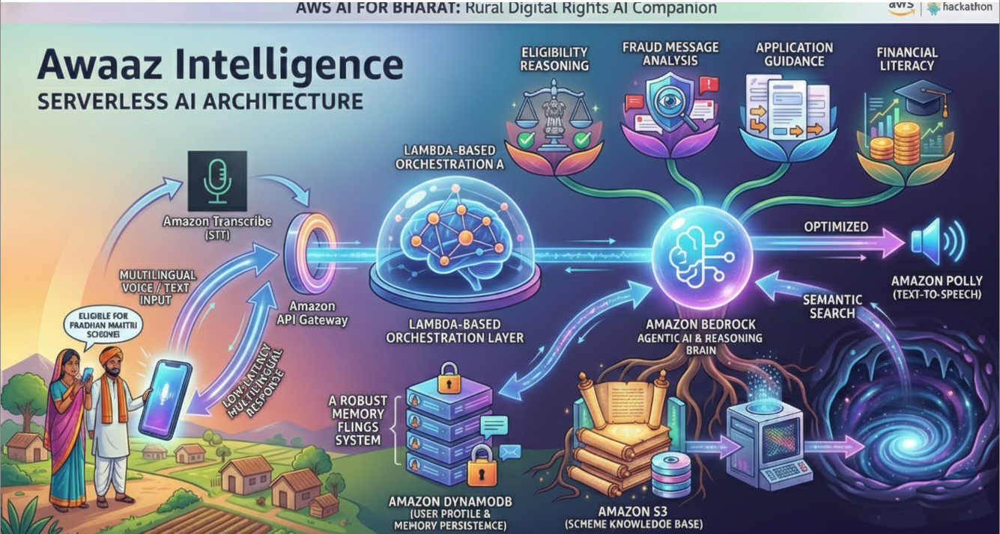
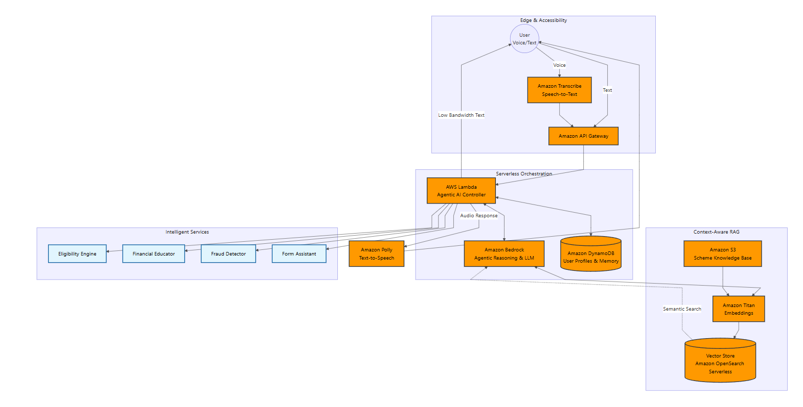
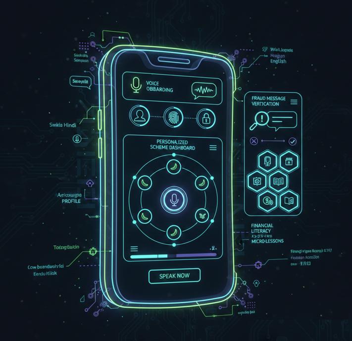

# Aawaz Intelligence  
## Agentic, Voice-First AI System for Inclusive Digital Access

Aawaz Intelligence is a serverless, agentic AI platform designed to improve access to government schemes, financial literacy, and fraud protection for rural and semi-urban users in India.

The system leverages Amazon Bedrock for intelligent reasoning, a context-aware Retrieval-Augmented Generation (RAG) pipeline for grounded responses, and a low-bandwidth voice-first interface to ensure accessibility.

---

## System Architecture

### Architecture Overview

The platform is built on a fully serverless AWS stack to ensure scalability, security, and cost efficiency.

### Core Flow

1. User interacts via voice or text.
2. Amazon Transcribe converts speech input into text.
3. Amazon API Gateway routes requests to AWS Lambda.
4. Lambda functions act as the orchestration layer.
5. Amazon Bedrock performs agentic reasoning and response generation.
6. Context-aware RAG retrieves relevant scheme data from Amazon S3.
7. Amazon DynamoDB maintains user profile and session memory.
8. Amazon Polly converts responses back into speech output.

### AWS Services Used

- Amazon Bedrock (LLM and agentic reasoning)
- AWS Lambda (orchestration and business logic)
- Amazon S3 (scheme knowledge base)
- Amazon DynamoDB (user memory and profiles)
- Amazon Titan Embeddings (semantic indexing)
- Amazon OpenSearch Serverless (vector storage)
- Amazon Transcribe (speech-to-text)
- Amazon Polly (text-to-speech)
- AWS IAM (security and role-based access control)

---

## Agentic AI Workflow

### Agentic Reasoning Model

Unlike static chatbot systems, Aawaz Intelligence implements a goal-driven orchestration model.

### Workflow Stages

1. Intent identification
2. Multi-step task planning
3. Tool invocation (Eligibility Engine, Fraud Detector, Financial Educator, Form Assistant)
4. Context fusion (user profile, location, previous interactions)
5. Semantic retrieval from knowledge base
6. Grounded response generation via Amazon Bedrock
7. Voice response synthesis

This design enables dynamic reasoning and contextual personalization rather than reactive Q&A.

---

## User Interface Wireframe

### UI Design Principles

The interface is designed for:

- Low literacy accessibility
- Multilingual interaction
- Minimal cognitive load
- Voice-first navigation
- Mobile-first deployment

### Core Interface Modules

- Voice onboarding
- Personalized scheme dashboard
- Fraud message verification
- Financial literacy micro-lessons
- Voice interaction control panel

---

## Context-Aware Retrieval Layer

The RAG pipeline enhances response accuracy by integrating:

- User demographic attributes
- Geographic filtering
- Historical session memory
- Verified government scheme documentation
- Semantic similarity search

This ensures responses remain grounded, personalized, and reliable.

---

## Security and Compliance

- Role-based access control via AWS IAM
- Encryption at rest and in transit
- Serverless architecture to minimize attack surface
- Minimal user data retention

---

## Deployment Objective

Initial deployment focuses on integrating:

- Bedrock-based agentic reasoning
- Context-aware RAG retrieval
- Voice interaction pipeline
- User memory persistence

The system is designed for horizontal scalability and cost-efficient operation.

---

## Repository Structure
