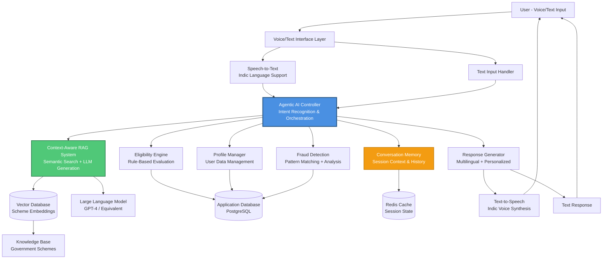
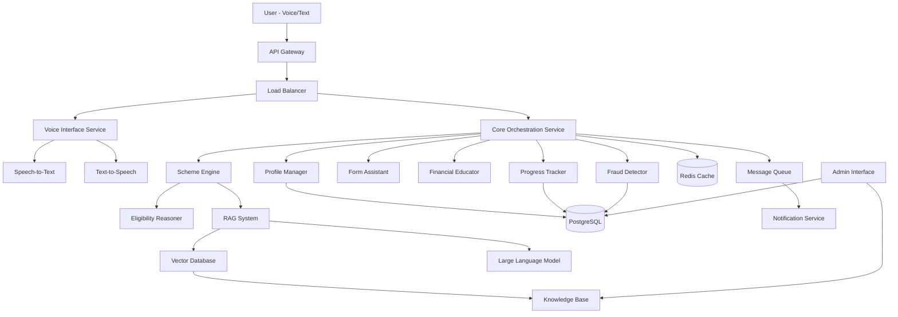
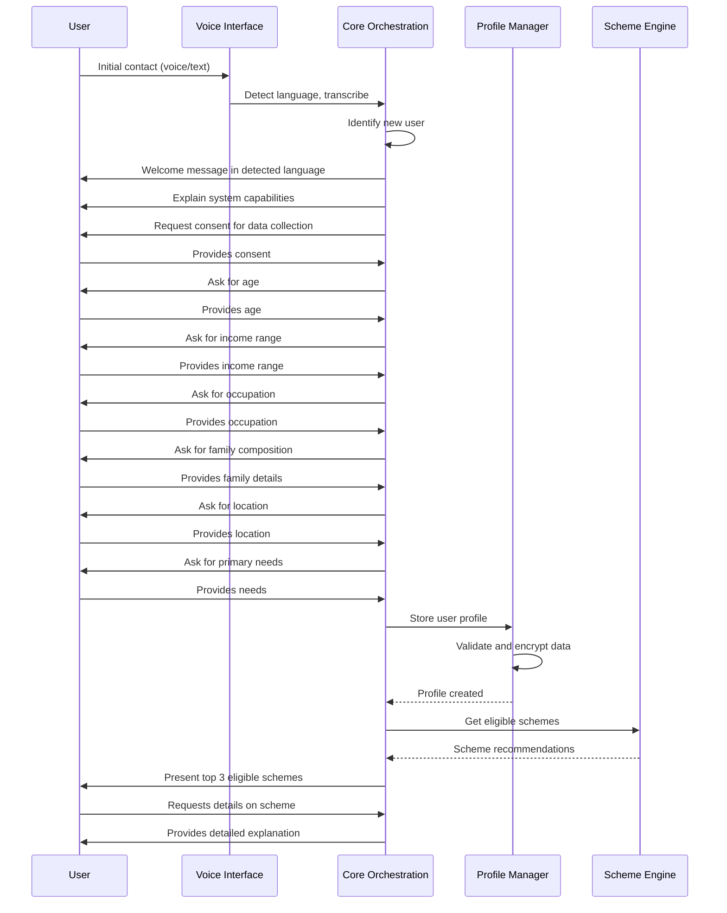
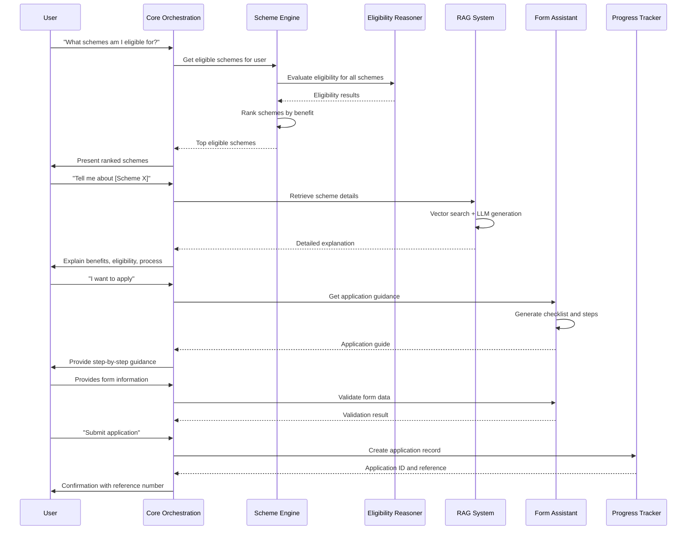
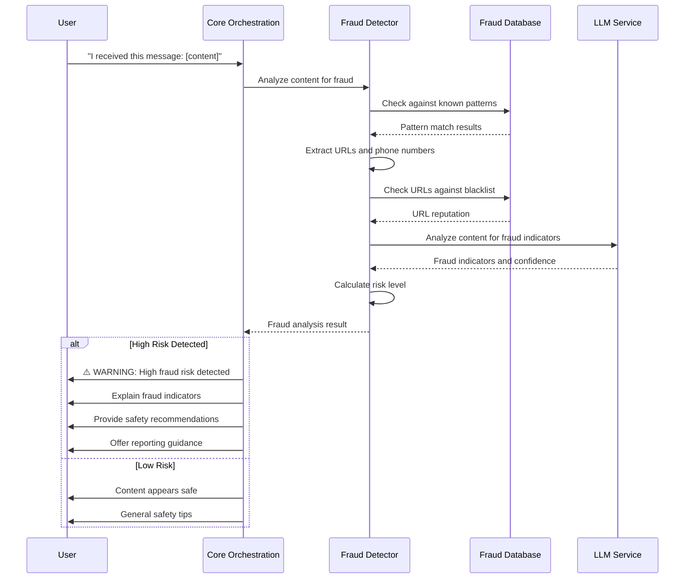
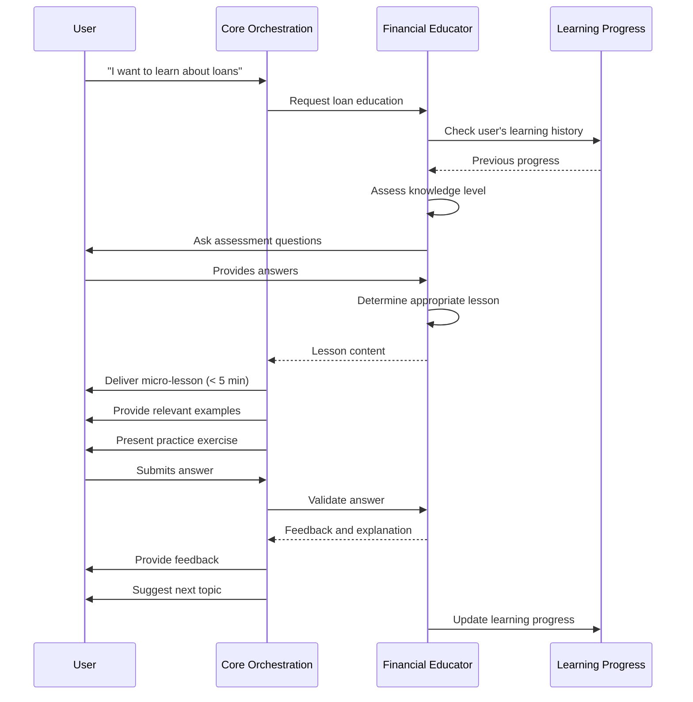
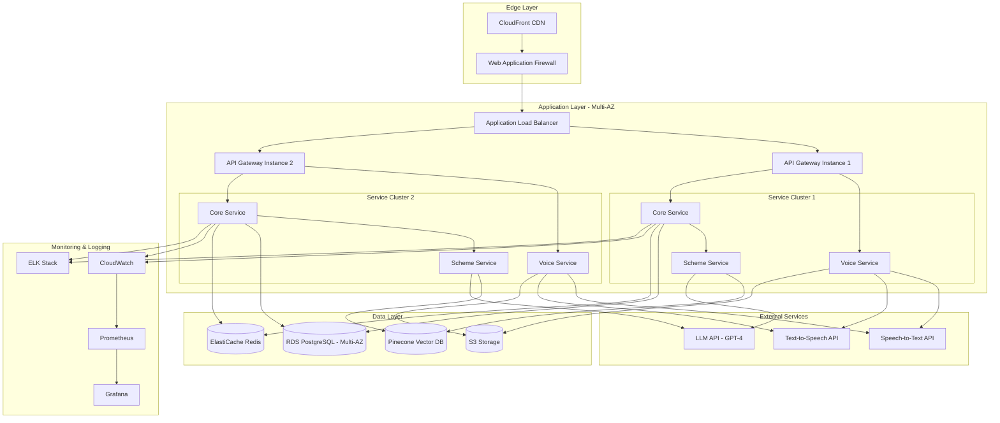

# Design Document: Rural Digital Rights AI Companion

## Overview

The Rural Digital Rights AI Companion is a cloud-based AI system that empowers rural and semi-urban Indian citizens through multilingual voice-first interactions. The system combines Large Language Models (LLMs), Retrieval Augmented Generation (RAG), speech recognition, and rule-based eligibility logic to provide personalized access to government welfare schemes, financial literacy education, and fraud protection.

### Design Goals

1. **Accessibility**: Voice-first interface requiring no literacy, supporting 6 Indian languages
2. **Accuracy**: Reliable eligibility determination and up-to-date government scheme information
3. **Performance**: Low-latency responses optimized for low-bandwidth environments
4. **Security**: End-to-end encryption and compliance with Indian data protection laws
5. **Scalability**: Support for millions of concurrent users with auto-scaling infrastructure
6. **Usability**: Simple, patient interactions designed for low-literacy populations

### Technology Stack

- **LLM**: GPT-4 or equivalent for natural language understanding and generation
- **Speech Recognition**: Whisper or Google Speech-to-Text with Indic language support
- **Speech Synthesis**: Google Text-to-Speech or Azure Speech with Indic voices
- **Vector Database**: Pinecone or Weaviate for RAG knowledge retrieval
- **Application Database**: PostgreSQL with encryption at rest
- **Cache Layer**: Redis for session management and frequently accessed data
- **Cloud Platform**: AWS or Google Cloud Platform
- **API Gateway**: Kong or AWS API Gateway for request routing and rate limiting
- **Message Queue**: RabbitMQ or AWS SQS for asynchronous processing
- **Monitoring**: Prometheus + Grafana for metrics, ELK stack for logging

## Architecture

### Simplified System Architecture (MVP View)

This simplified view illustrates the core data flow and key components for the MVP implementation, emphasizing the agentic AI orchestration layer and context-aware RAG system.



#### Key Architectural Principles

1. **Agentic AI Orchestration**: The Agentic AI Controller serves as the central intelligence layer that:
   - Recognizes user intent from natural language input
   - Maintains conversation context across multiple turns
   - Dynamically routes requests to appropriate specialized engines
   - Coordinates multi-step workflows (e.g., profile collection → eligibility check → application guidance)
   - Handles error recovery and fallback strategies
   - Adapts responses based on user profile and interaction history

2. **Context-Aware RAG System**: Enhanced retrieval-augmented generation that:
   - Performs semantic search over government scheme documentation
   - Incorporates user profile context (location, income, occupation) into retrieval
   - Uses conversation history to refine search queries
   - Grounds LLM responses in verified official documentation
   - Provides source citations for all scheme information
   - Adapts language complexity based on user literacy level

3. **Conversation Memory**: Persistent session management that:
   - Tracks conversation history and entities across turns
   - Maintains user preferences and interaction patterns
   - Enables contextual follow-up questions without repetition
   - Supports session resumption after disconnection
   - Stores conversation state in Redis for fast access

4. **Multilingual Response Generation**: Language-aware output that:
   - Translates responses to user's preferred language
   - Uses culturally appropriate examples and terminology
   - Maintains consistent official term translations
   - Synthesizes natural-sounding speech in Indic languages
   - Adapts to voice or text output based on user preference and bandwidth

#### Data Flow Example: Scheme Discovery

1. User asks (voice): "मुझे कौन सी योजनाएं मिल सकती हैं?" (What schemes can I get?)
2. Speech-to-Text transcribes to text
3. Agentic AI Controller:
   - Recognizes intent: SCHEME_DISCOVERY
   - Retrieves user profile from Profile Manager
   - Checks conversation memory for context
4. Eligibility Engine evaluates all schemes against user profile
5. Context-Aware RAG System:
   - Retrieves top eligible schemes from Vector Database
   - Generates personalized explanations using LLM with user context
6. Response Generator:
   - Formats response in Hindi
   - Prioritizes top 3 schemes by benefit value
7. Text-to-Speech synthesizes Hindi audio response
8. User receives: "आपके लिए ये तीन योजनाएं उपलब्ध हैं..." (These three schemes are available for you...)

## Detailed Architecture

## Detailed Architecture

### Component Architecture Diagram




### System Components

#### 1. API Gateway and Load Balancer
- **Purpose**: Entry point for all user requests, handles authentication, rate limiting, and routing
- **Technology**: Kong API Gateway or AWS API Gateway + Application Load Balancer
- **Responsibilities**:
  - Request authentication and authorization
  - Rate limiting (per user and global)
  - Request routing to appropriate services
  - SSL/TLS termination
  - Request/response logging

#### 2. Voice Interface Service
- **Purpose**: Handles speech recognition and synthesis for voice interactions
- **Components**:
  - Speech-to-Text (STT) adapter
  - Text-to-Speech (TTS) adapter
  - Audio compression for low-bandwidth mode
  - Language detection
- **Responsibilities**:
  - Convert user speech to text in 6 supported languages
  - Synthesize system responses to natural-sounding speech
  - Detect user's language from audio input
  - Compress audio for low-bandwidth transmission
  - Handle audio streaming for real-time interaction


#### 3. Core Orchestration Service (Agentic AI Controller)
- **Purpose**: Central agentic AI coordinator managing conversation flow, intent recognition, and intelligent service orchestration
- **Agentic Capabilities**:
  - Autonomous decision-making for routing user requests to appropriate services
  - Multi-step workflow planning and execution (e.g., profile collection → eligibility → application)
  - Dynamic adaptation based on user responses and context
  - Proactive suggestions and recommendations
  - Error recovery and alternative path exploration
- **Responsibilities**:
  - Maintain conversation context and session state with memory
  - Recognize user intent from natural language input
  - Route requests to appropriate specialized services based on intent
  - Aggregate responses from multiple services into coherent replies
  - Manage conversation flow and dialogue state transitions
  - Handle error recovery and fallback strategies
  - Implement conversation memory and context tracking across turns
  - Coordinate complex multi-turn interactions
  - Adapt communication style based on user profile and preferences

#### 4. Profile Manager
- **Purpose**: Manages user demographic data and preferences
- **Data Model**:
  ```typescript
  interface UserProfile {
    userId: string;
    age: number;
    incomeRange: 'below-1L' | '1L-3L' | '3L-5L' | 'above-5L';
    occupation: string;
    familyComposition: {
      adults: number;
      children: number;
      seniors: number;
    };
    location: {
      state: string;
      district: string;
      block?: string;
      village?: string;
    };
    primaryNeeds: string[];
    preferredLanguage: 'hi' | 'ta' | 'te' | 'bn' | 'mr' | 'en';
    consentGiven: boolean;
    createdAt: Date;
    updatedAt: Date;
  }
  ```
- **Responsibilities**:
  - Collect and validate user profile information
  - Encrypt sensitive data before storage
  - Provide profile data to other services
  - Handle profile updates and deletions
  - Manage user consent and privacy preferences

#### 5. Scheme Engine
- **Purpose**: Determines government scheme eligibility and provides recommendations
- **Components**:
  - Eligibility Reasoner (rule-based engine)
  - RAG System for scheme information retrieval
  - Ranking algorithm for scheme prioritization
- **Responsibilities**:
  - Evaluate user eligibility for all relevant schemes
  - Retrieve detailed scheme information from Knowledge Base
  - Rank eligible schemes by estimated benefit value
  - Explain eligibility decisions with reasoning
  - Handle both central and state-specific schemes


#### 6. Eligibility Reasoner
- **Purpose**: Rule-based engine for determining scheme eligibility
- **Algorithm**:
  ```python
  def evaluate_eligibility(user_profile, scheme):
      # Load scheme eligibility rules
      rules = scheme.eligibility_rules
      
      # Evaluate each rule
      results = []
      for rule in rules:
          result = evaluate_rule(rule, user_profile)
          results.append({
              'rule': rule.name,
              'passed': result.passed,
              'reason': result.reason
          })
      
      # Determine overall eligibility
      eligible = all(r['passed'] for r in results)
      
      # Generate explanation
      explanation = generate_explanation(results, eligible)
      
      return {
          'eligible': eligible,
          'confidence': calculate_confidence(results),
          'explanation': explanation,
          'missing_criteria': [r for r in results if not r['passed']]
      }
  
  def evaluate_rule(rule, profile):
      # Age-based rules
      if rule.type == 'age_range':
          return profile.age >= rule.min_age and profile.age <= rule.max_age
      
      # Income-based rules
      if rule.type == 'income_threshold':
          return income_to_numeric(profile.incomeRange) <= rule.max_income
      
      # Location-based rules
      if rule.type == 'location':
          return profile.location.state in rule.eligible_states
      
      # Occupation-based rules
      if rule.type == 'occupation':
          return profile.occupation in rule.eligible_occupations
      
      # Family composition rules
      if rule.type == 'family':
          return evaluate_family_criteria(profile.familyComposition, rule.criteria)
      
      return False
  ```

#### 7. Context-Aware RAG System
- **Purpose**: Retrieves relevant government scheme information using context-aware vector similarity search and generates grounded responses
- **Context-Aware Enhancements**:
  - User profile integration: Incorporates user's location, income, occupation into retrieval
  - Conversation history awareness: Uses previous turns to refine search queries
  - Intent-based filtering: Adjusts retrieval strategy based on user's current goal
  - Personalized ranking: Prioritizes results most relevant to user's specific situation
  - Adaptive language complexity: Adjusts explanation depth based on user literacy level
- **Architecture**:
  - Document chunking and embedding generation with metadata
  - Vector database for semantic search with filtering
  - LLM for response generation with retrieved context and user profile
  - Source citation and fact verification layer
- **Process Flow**:
  1. User query + User profile + Conversation history → Enhanced query construction
  2. Embed enhanced query using same model as documents
  3. Vector similarity search with metadata filtering (location, category, etc.)
  4. Retrieve top-k most relevant document chunks
  5. Construct prompt with: retrieved context + user profile + conversation history + user query
  6. LLM generates response grounded in retrieved information and personalized to user
  7. Post-process response for language, simplicity, and cultural appropriateness
  8. Add source citations and confidence indicators


#### 8. Form Assistant
- **Purpose**: Provides step-by-step guidance for government scheme applications
- **Data Model**:
  ```typescript
  interface ApplicationForm {
    schemeId: string;
    schemeName: string;
    steps: FormStep[];
    documentRequirements: DocumentRequirement[];
    submissionMethods: SubmissionMethod[];
  }
  
  interface FormStep {
    stepNumber: number;
    title: string;
    description: string;
    fields: FormField[];
    commonMistakes: string[];
  }
  
  interface FormField {
    fieldName: string;
    fieldType: 'text' | 'number' | 'date' | 'select' | 'file';
    required: boolean;
    validation: ValidationRule[];
    helpText: string;
    examples: string[];
  }
  
  interface DocumentRequirement {
    documentName: string;
    purpose: string;
    whereToObtain: string;
    alternatives: string[];
    format: 'original' | 'photocopy' | 'digital';
  }
  ```
- **Responsibilities**:
  - Generate personalized application checklists
  - Explain each form field in simple language
  - Provide examples relevant to user context
  - Warn about common mistakes
  - Suggest document alternatives when originals unavailable

#### 9. Financial Educator
- **Purpose**: Delivers interactive financial literacy lessons
- **Content Structure**:
  ```typescript
  interface FinancialLesson {
    lessonId: string;
    topic: 'budgeting' | 'loans' | 'savings' | 'insurance' | 'digital_payments';
    difficulty: 'beginner' | 'intermediate' | 'advanced';
    duration: number; // minutes
    prerequisites: string[];
    content: LessonContent[];
    exercises: Exercise[];
  }
  
  interface LessonContent {
    type: 'explanation' | 'example' | 'scenario' | 'tip';
    text: string;
    audioUrl?: string;
    visualAid?: string;
  }
  
  interface Exercise {
    question: string;
    type: 'multiple_choice' | 'scenario' | 'calculation';
    options?: string[];
    correctAnswer: string;
    explanation: string;
  }
  ```
- **Pedagogical Approach**:
  - Assess current knowledge through conversational questions
  - Deliver micro-lessons (< 5 minutes each)
  - Use rural/semi-urban context examples
  - Provide practical exercises
  - Track progress and suggest next topics
  - Adapt difficulty based on user responses


#### 10. Fraud Detector
- **Purpose**: Analyzes messages, calls, and links for fraud patterns
- **Detection Methods**:
  1. **Pattern Matching**: Compare against known fraud signatures
  2. **URL Analysis**: Check domains against blacklists and reputation databases
  3. **Content Analysis**: LLM-based analysis of message content for fraud indicators
  4. **Behavioral Analysis**: Detect urgency tactics, impersonation, and social engineering
- **Data Model**:
  ```typescript
  interface FraudAnalysisRequest {
    userId: string;
    contentType: 'message' | 'call_transcript' | 'url';
    content: string;
    metadata?: {
      senderNumber?: string;
      timestamp?: Date;
      platform?: string;
    };
  }
  
  interface FraudAnalysisResult {
    riskLevel: 'low' | 'medium' | 'high' | 'critical';
    confidence: number; // 0-1
    indicators: FraudIndicator[];
    explanation: string;
    recommendations: string[];
    reportingGuidance?: string;
  }
  
  interface FraudIndicator {
    type: 'phishing' | 'impersonation' | 'fake_scheme' | 'urgency_tactic' | 'suspicious_url';
    description: string;
    severity: number; // 0-10
  }
  ```
- **Fraud Pattern Database**:
  - Known scam phone numbers and domains
  - Fake government scheme names
  - Common phishing phrases in all supported languages
  - Impersonation tactics (fake officials, fake organizations)
  - Updated weekly from crowdsourced reports and official sources

#### 11. Progress Tracker
- **Purpose**: Monitors application status and notifies users of updates
- **Data Model**:
  ```typescript
  interface Application {
    applicationId: string;
    userId: string;
    schemeId: string;
    schemeName: string;
    status: ApplicationStatus;
    submissionDate: Date;
    referenceNumber?: string;
    currentStage: string;
    estimatedCompletionDate?: Date;
    history: StatusUpdate[];
    requiredActions: Action[];
  }
  
  enum ApplicationStatus {
    DRAFT = 'draft',
    SUBMITTED = 'submitted',
    UNDER_REVIEW = 'under_review',
    ADDITIONAL_INFO_REQUIRED = 'additional_info_required',
    APPROVED = 'approved',
    REJECTED = 'rejected',
    BENEFITS_DISBURSED = 'benefits_disbursed'
  }
  
  interface StatusUpdate {
    timestamp: Date;
    previousStatus: ApplicationStatus;
    newStatus: ApplicationStatus;
    notes?: string;
    updatedBy: 'system' | 'user' | 'admin';
  }
  
  interface Action {
    actionType: 'submit_document' | 'verify_information' | 'visit_office';
    description: string;
    deadline?: Date;
    completed: boolean;
  }
  ```


#### 12. Knowledge Base
- **Purpose**: Centralized repository of government scheme information
- **Content Structure**:
  ```typescript
  interface GovernmentScheme {
    schemeId: string;
    officialName: string;
    localizedNames: Record<Language, string>;
    category: 'agriculture' | 'education' | 'health' | 'housing' | 'employment' | 'pension' | 'other';
    level: 'central' | 'state';
    state?: string; // for state-specific schemes
    description: Record<Language, string>;
    benefits: Benefit[];
    eligibilityRules: EligibilityRule[];
    applicationProcess: ApplicationProcess;
    requiredDocuments: DocumentRequirement[];
    officialSources: string[];
    lastUpdated: Date;
    version: number;
  }
  
  interface Benefit {
    type: 'monetary' | 'subsidy' | 'service' | 'asset';
    description: Record<Language, string>;
    amount?: number;
    frequency?: 'one-time' | 'monthly' | 'annual';
    duration?: string;
  }
  
  interface EligibilityRule {
    ruleId: string;
    type: 'age_range' | 'income_threshold' | 'location' | 'occupation' | 'family';
    parameters: Record<string, any>;
    description: Record<Language, string>;
  }
  ```
- **Update Process**:
  1. Admin uploads official scheme documentation
  2. Document parsing and information extraction
  3. Validation against schema
  4. Translation to all supported languages
  5. Review and approval
  6. Publication to vector database and application database
  7. Notification to affected users

#### 13. Translation Service
- **Purpose**: Ensures consistent multilingual content across the system
- **Components**:
  - Translation memory for consistent terminology
  - Glossary of official terms in all languages
  - Machine translation with human review
  - Context-aware translation using LLM
- **Translation Strategy**:
  - Official government terms: Use official multilingual names
  - Technical terms: Maintain glossary with approved translations
  - Dynamic content: LLM-based translation with terminology constraints
  - User-generated content: Real-time translation with quality checks


## Components and Interfaces

### API Interfaces

#### User Interaction API
```typescript
// Voice interaction endpoint
POST /api/v1/interact/voice
Request: {
  audio: base64_encoded_audio,
  language?: string,
  sessionId?: string,
  lowBandwidthMode?: boolean
}
Response: {
  sessionId: string,
  textResponse: string,
  audioResponse?: base64_encoded_audio,
  suggestedActions?: Action[],
  conversationContext: ConversationContext
}

// Text interaction endpoint
POST /api/v1/interact/text
Request: {
  message: string,
  language: string,
  sessionId?: string
}
Response: {
  sessionId: string,
  response: string,
  suggestedActions?: Action[],
  conversationContext: ConversationContext
}
```

#### Profile Management API
```typescript
// Create or update user profile
POST /api/v1/profile
Request: UserProfile
Response: {
  userId: string,
  success: boolean,
  message: string
}

// Get user profile
GET /api/v1/profile/{userId}
Response: UserProfile

// Delete user profile
DELETE /api/v1/profile/{userId}
Response: {
  success: boolean,
  message: string
}
```

#### Scheme Discovery API
```typescript
// Get eligible schemes for user
GET /api/v1/schemes/eligible/{userId}
Response: {
  schemes: SchemeRecommendation[],
  totalCount: number
}

interface SchemeRecommendation {
  scheme: GovernmentScheme,
  eligibilityResult: EligibilityResult,
  estimatedBenefit: number,
  priority: number
}

// Get scheme details
GET /api/v1/schemes/{schemeId}
Query: { language: string }
Response: GovernmentScheme

// Search schemes
POST /api/v1/schemes/search
Request: {
  query: string,
  language: string,
  filters?: {
    category?: string[],
    level?: 'central' | 'state',
    state?: string
  }
}
Response: {
  schemes: GovernmentScheme[],
  totalCount: number
}
```


#### Application Management API
```typescript
// Create application
POST /api/v1/applications
Request: {
  userId: string,
  schemeId: string,
  formData?: Record<string, any>
}
Response: Application

// Get application status
GET /api/v1/applications/{applicationId}
Response: Application

// Update application
PATCH /api/v1/applications/{applicationId}
Request: {
  status?: ApplicationStatus,
  formData?: Record<string, any>,
  notes?: string
}
Response: Application

// List user applications
GET /api/v1/applications/user/{userId}
Response: {
  applications: Application[],
  totalCount: number
}
```

#### Fraud Detection API
```typescript
// Analyze content for fraud
POST /api/v1/fraud/analyze
Request: FraudAnalysisRequest
Response: FraudAnalysisResult

// Report fraud
POST /api/v1/fraud/report
Request: {
  userId: string,
  fraudType: string,
  description: string,
  evidence?: string[]
}
Response: {
  reportId: string,
  success: boolean,
  nextSteps: string[]
}
```

#### Financial Education API
```typescript
// Get available lessons
GET /api/v1/education/lessons
Query: {
  topic?: string,
  difficulty?: string,
  language: string
}
Response: {
  lessons: FinancialLesson[],
  totalCount: number
}

// Start lesson
POST /api/v1/education/lessons/{lessonId}/start
Request: {
  userId: string
}
Response: {
  sessionId: string,
  lesson: FinancialLesson,
  progress: LearningProgress
}

// Submit exercise answer
POST /api/v1/education/exercises/{exerciseId}/submit
Request: {
  userId: string,
  sessionId: string,
  answer: string
}
Response: {
  correct: boolean,
  explanation: string,
  nextExercise?: Exercise
}
```


### Internal Service Interfaces

#### Eligibility Reasoner Interface
```python
class EligibilityReasoner:
    def evaluate_eligibility(
        self,
        user_profile: UserProfile,
        scheme: GovernmentScheme
    ) -> EligibilityResult:
        """
        Evaluates whether a user is eligible for a scheme.
        Returns detailed eligibility result with reasoning.
        """
        pass
    
    def batch_evaluate(
        self,
        user_profile: UserProfile,
        schemes: List[GovernmentScheme]
    ) -> List[EligibilityResult]:
        """
        Evaluates eligibility for multiple schemes efficiently.
        """
        pass
    
    def explain_ineligibility(
        self,
        user_profile: UserProfile,
        scheme: GovernmentScheme
    ) -> str:
        """
        Generates human-readable explanation of why user is ineligible.
        """
        pass
```

#### RAG System Interface
```python
class RAGSystem:
    def retrieve_and_generate(
        self,
        query: str,
        language: str,
        context: Optional[Dict] = None,
        max_chunks: int = 5
    ) -> RAGResponse:
        """
        Retrieves relevant documents and generates response.
        """
        pass
    
    def index_document(
        self,
        document: Document,
        metadata: Dict
    ) -> str:
        """
        Indexes a document in the vector database.
        Returns document ID.
        """
        pass
    
    def update_document(
        self,
        document_id: str,
        document: Document
    ) -> bool:
        """
        Updates an existing document in the index.
        """
        pass
```

#### Translation Service Interface
```python
class TranslationService:
    def translate(
        self,
        text: str,
        source_language: str,
        target_language: str,
        domain: Optional[str] = None
    ) -> str:
        """
        Translates text maintaining domain-specific terminology.
        """
        pass
    
    def batch_translate(
        self,
        texts: List[str],
        source_language: str,
        target_language: str
    ) -> List[str]:
        """
        Translates multiple texts efficiently.
        """
        pass
    
    def get_term_translation(
        self,
        term: str,
        target_language: str
    ) -> Optional[str]:
        """
        Gets official translation for a term from glossary.
        """
        pass
```


## Data Models

### Core Data Models

#### User Profile
```typescript
interface UserProfile {
  userId: string;                    // UUID
  phoneNumber?: string;              // Encrypted
  age: number;                       // 1-120
  incomeRange: IncomeRange;
  occupation: string;
  familyComposition: FamilyComposition;
  location: Location;
  primaryNeeds: string[];            // e.g., ["healthcare", "education", "housing"]
  preferredLanguage: Language;
  preferredMode: 'voice' | 'text' | 'both';
  consentGiven: boolean;
  consentDate?: Date;
  createdAt: Date;
  updatedAt: Date;
  lastActiveAt: Date;
}

enum IncomeRange {
  BELOW_1L = 'below-1L',
  ONE_TO_THREE_L = '1L-3L',
  THREE_TO_FIVE_L = '3L-5L',
  ABOVE_5L = 'above-5L'
}

interface FamilyComposition {
  adults: number;                    // 18+ years
  children: number;                  // 0-17 years
  seniors: number;                   // 60+ years
  dependents: number;
}

interface Location {
  state: string;
  district: string;
  block?: string;
  village?: string;
  pincode?: string;
  coordinates?: {
    latitude: number;
    longitude: number;
  };
}

type Language = 'hi' | 'ta' | 'te' | 'bn' | 'mr' | 'en';
```

#### Government Scheme
```typescript
interface GovernmentScheme {
  schemeId: string;
  officialName: string;
  localizedNames: Record<Language, string>;
  shortDescription: Record<Language, string>;
  detailedDescription: Record<Language, string>;
  category: SchemeCategory;
  level: 'central' | 'state';
  state?: string;
  launchDate: Date;
  endDate?: Date;
  active: boolean;
  
  benefits: Benefit[];
  eligibilityRules: EligibilityRule[];
  applicationProcess: ApplicationProcess;
  requiredDocuments: DocumentRequirement[];
  
  officialWebsite?: string;
  helplineNumber?: string;
  officialSources: string[];
  
  metadata: {
    lastUpdated: Date;
    version: number;
    updatedBy: string;
    verificationStatus: 'verified' | 'pending' | 'outdated';
  };
}

enum SchemeCategory {
  AGRICULTURE = 'agriculture',
  EDUCATION = 'education',
  HEALTH = 'health',
  HOUSING = 'housing',
  EMPLOYMENT = 'employment',
  PENSION = 'pension',
  WOMEN_WELFARE = 'women_welfare',
  CHILD_WELFARE = 'child_welfare',
  DISABILITY = 'disability',
  FINANCIAL_INCLUSION = 'financial_inclusion',
  OTHER = 'other'
}
```


#### Eligibility Rule
```typescript
interface EligibilityRule {
  ruleId: string;
  type: RuleType;
  operator: 'AND' | 'OR' | 'NOT';
  parameters: RuleParameters;
  description: Record<Language, string>;
  priority: number;                  // Higher priority rules evaluated first
}

enum RuleType {
  AGE_RANGE = 'age_range',
  INCOME_THRESHOLD = 'income_threshold',
  LOCATION = 'location',
  OCCUPATION = 'occupation',
  FAMILY_COMPOSITION = 'family_composition',
  GENDER = 'gender',
  DISABILITY = 'disability',
  LAND_OWNERSHIP = 'land_ownership',
  CUSTOM = 'custom'
}

type RuleParameters = 
  | AgeRangeParams
  | IncomeThresholdParams
  | LocationParams
  | OccupationParams
  | FamilyCompositionParams
  | CustomParams;

interface AgeRangeParams {
  minAge?: number;
  maxAge?: number;
}

interface IncomeThresholdParams {
  maxIncome: number;                 // Annual income in INR
  includeRange?: IncomeRange[];
}

interface LocationParams {
  eligibleStates?: string[];
  eligibleDistricts?: string[];
  ruralOnly?: boolean;
  urbanOnly?: boolean;
}

interface OccupationParams {
  eligibleOccupations?: string[];
  excludedOccupations?: string[];
}

interface FamilyCompositionParams {
  minChildren?: number;
  maxChildren?: number;
  minSeniors?: number;
  requiresDependent?: boolean;
}

interface CustomParams {
  expression: string;                // Custom logic expression
  variables: Record<string, any>;
}
```

#### Conversation Context
```typescript
interface ConversationContext {
  sessionId: string;
  userId: string;
  language: Language;
  mode: 'voice' | 'text';
  lowBandwidthMode: boolean;
  
  currentIntent: Intent;
  conversationHistory: Message[];
  entities: Record<string, any>;
  
  activeScheme?: string;             // Currently discussing scheme
  activeApplication?: string;        // Currently working on application
  activeLesson?: string;             // Currently in lesson
  
  metadata: {
    startTime: Date;
    lastInteractionTime: Date;
    turnCount: number;
    userSatisfaction?: number;       // 1-5 rating
  };
}

enum Intent {
  ONBOARDING = 'onboarding',
  SCHEME_DISCOVERY = 'scheme_discovery',
  SCHEME_DETAILS = 'scheme_details',
  APPLICATION_HELP = 'application_help',
  FINANCIAL_EDUCATION = 'financial_education',
  FRAUD_CHECK = 'fraud_check',
  PROGRESS_CHECK = 'progress_check',
  PROFILE_UPDATE = 'profile_update',
  GENERAL_QUERY = 'general_query'
}

interface Message {
  role: 'user' | 'assistant' | 'system';
  content: string;
  timestamp: Date;
  metadata?: {
    audioUrl?: string;
    confidence?: number;
    language?: Language;
  };
}
```


### Database Schema

#### PostgreSQL Tables

```sql
-- Users table
CREATE TABLE users (
    user_id UUID PRIMARY KEY DEFAULT gen_random_uuid(),
    phone_number_encrypted BYTEA,
    age INTEGER CHECK (age BETWEEN 1 AND 120),
    income_range VARCHAR(20),
    occupation VARCHAR(100),
    family_adults INTEGER DEFAULT 0,
    family_children INTEGER DEFAULT 0,
    family_seniors INTEGER DEFAULT 0,
    location_state VARCHAR(100),
    location_district VARCHAR(100),
    location_block VARCHAR(100),
    location_village VARCHAR(100),
    primary_needs TEXT[],
    preferred_language VARCHAR(2),
    preferred_mode VARCHAR(10),
    consent_given BOOLEAN DEFAULT FALSE,
    consent_date TIMESTAMP,
    created_at TIMESTAMP DEFAULT NOW(),
    updated_at TIMESTAMP DEFAULT NOW(),
    last_active_at TIMESTAMP DEFAULT NOW()
);

CREATE INDEX idx_users_location ON users(location_state, location_district);
CREATE INDEX idx_users_income ON users(income_range);
CREATE INDEX idx_users_age ON users(age);

-- Schemes table
CREATE TABLE schemes (
    scheme_id UUID PRIMARY KEY DEFAULT gen_random_uuid(),
    official_name VARCHAR(500) NOT NULL,
    category VARCHAR(50),
    level VARCHAR(10),
    state VARCHAR(100),
    launch_date DATE,
    end_date DATE,
    active BOOLEAN DEFAULT TRUE,
    official_website TEXT,
    helpline_number VARCHAR(20),
    last_updated TIMESTAMP DEFAULT NOW(),
    version INTEGER DEFAULT 1,
    verification_status VARCHAR(20)
);

CREATE INDEX idx_schemes_category ON schemes(category);
CREATE INDEX idx_schemes_level_state ON schemes(level, state);
CREATE INDEX idx_schemes_active ON schemes(active);

-- Scheme localized content
CREATE TABLE scheme_content (
    content_id UUID PRIMARY KEY DEFAULT gen_random_uuid(),
    scheme_id UUID REFERENCES schemes(scheme_id) ON DELETE CASCADE,
    language VARCHAR(2),
    localized_name VARCHAR(500),
    short_description TEXT,
    detailed_description TEXT,
    UNIQUE(scheme_id, language)
);

-- Eligibility rules
CREATE TABLE eligibility_rules (
    rule_id UUID PRIMARY KEY DEFAULT gen_random_uuid(),
    scheme_id UUID REFERENCES schemes(scheme_id) ON DELETE CASCADE,
    rule_type VARCHAR(50),
    operator VARCHAR(10),
    parameters JSONB,
    priority INTEGER DEFAULT 0
);

CREATE INDEX idx_rules_scheme ON eligibility_rules(scheme_id);

-- Applications
CREATE TABLE applications (
    application_id UUID PRIMARY KEY DEFAULT gen_random_uuid(),
    user_id UUID REFERENCES users(user_id) ON DELETE CASCADE,
    scheme_id UUID REFERENCES schemes(scheme_id),
    status VARCHAR(50),
    reference_number VARCHAR(100),
    current_stage VARCHAR(100),
    submission_date TIMESTAMP,
    estimated_completion_date DATE,
    form_data JSONB,
    created_at TIMESTAMP DEFAULT NOW(),
    updated_at TIMESTAMP DEFAULT NOW()
);

CREATE INDEX idx_applications_user ON applications(user_id);
CREATE INDEX idx_applications_status ON applications(status);

-- Application status history
CREATE TABLE application_history (
    history_id UUID PRIMARY KEY DEFAULT gen_random_uuid(),
    application_id UUID REFERENCES applications(application_id) ON DELETE CASCADE,
    previous_status VARCHAR(50),
    new_status VARCHAR(50),
    notes TEXT,
    updated_by VARCHAR(50),
    timestamp TIMESTAMP DEFAULT NOW()
);

-- Fraud reports
CREATE TABLE fraud_reports (
    report_id UUID PRIMARY KEY DEFAULT gen_random_uuid(),
    user_id UUID REFERENCES users(user_id),
    fraud_type VARCHAR(100),
    content TEXT,
    risk_level VARCHAR(20),
    confidence DECIMAL(3,2),
    indicators JSONB,
    reported_at TIMESTAMP DEFAULT NOW()
);

CREATE INDEX idx_fraud_risk ON fraud_reports(risk_level);
CREATE INDEX idx_fraud_user ON fraud_reports(user_id);

-- Learning progress
CREATE TABLE learning_progress (
    progress_id UUID PRIMARY KEY DEFAULT gen_random_uuid(),
    user_id UUID REFERENCES users(user_id) ON DELETE CASCADE,
    lesson_id VARCHAR(100),
    topic VARCHAR(50),
    status VARCHAR(20),
    score INTEGER,
    completed_at TIMESTAMP,
    UNIQUE(user_id, lesson_id)
);

CREATE INDEX idx_learning_user ON learning_progress(user_id);
```


## User Flow Diagrams

### User Onboarding Flow



### Scheme Discovery and Application Flow




### Fraud Detection Flow



### Financial Education Flow




## Cloud Deployment Strategy

### Infrastructure Architecture



### Deployment Configuration

#### AWS Services
- **Compute**: ECS Fargate for containerized services (auto-scaling)
- **Database**: RDS PostgreSQL with Multi-AZ deployment, read replicas
- **Cache**: ElastiCache Redis for session management and frequently accessed data
- **Storage**: S3 for audio files, documents, and backups
- **CDN**: CloudFront for static content delivery
- **Load Balancing**: Application Load Balancer with health checks
- **API Management**: API Gateway for request routing, throttling, and authentication
- **Security**: WAF for DDoS protection, KMS for encryption key management
- **Monitoring**: CloudWatch for metrics, CloudWatch Logs for centralized logging
- **Queue**: SQS for asynchronous task processing
- **Notifications**: SNS for user notifications

#### Container Configuration
```yaml
# Core Orchestration Service
service: core-orchestration
replicas: 3-10 (auto-scaling)
cpu: 2 vCPU
memory: 4 GB
health_check: /health
environment:
  - DATABASE_URL: encrypted
  - REDIS_URL: encrypted
  - LLM_API_KEY: encrypted
  - LOG_LEVEL: info

# Voice Interface Service
service: voice-interface
replicas: 2-8 (auto-scaling)
cpu: 1 vCPU
memory: 2 GB
health_check: /health
environment:
  - STT_API_KEY: encrypted
  - TTS_API_KEY: encrypted
  - S3_BUCKET: audio-storage

# Scheme Engine Service
service: scheme-engine
replicas: 2-6 (auto-scaling)
cpu: 2 vCPU
memory: 4 GB
health_check: /health
environment:
  - VECTOR_DB_URL: encrypted
  - LLM_API_KEY: encrypted
  - DATABASE_URL: encrypted
```


### Auto-Scaling Configuration

```yaml
# Core Service Auto-Scaling
scaling_policy:
  min_instances: 3
  max_instances: 10
  target_cpu_utilization: 70%
  target_memory_utilization: 80%
  scale_up_cooldown: 60s
  scale_down_cooldown: 300s
  
  custom_metrics:
    - metric: active_sessions
      threshold: 1000
      scale_up_adjustment: +2
    - metric: request_latency_p95
      threshold: 2000ms
      scale_up_adjustment: +1

# Voice Service Auto-Scaling
scaling_policy:
  min_instances: 2
  max_instances: 8
  target_cpu_utilization: 75%
  scale_up_on_queue_depth: 50
  
# Database Read Replica Auto-Scaling
rds_scaling:
  min_read_replicas: 1
  max_read_replicas: 5
  target_cpu_utilization: 70%
  target_connections: 80%
```

### Disaster Recovery and Backup

```yaml
backup_strategy:
  database:
    automated_backups: daily
    retention_period: 30 days
    point_in_time_recovery: enabled
    cross_region_replication: enabled
    backup_window: "02:00-04:00 UTC"
  
  application_data:
    s3_versioning: enabled
    s3_lifecycle_policy:
      - transition_to_glacier: 90 days
      - expiration: 365 days
    cross_region_replication: enabled
  
  disaster_recovery:
    rto: 4 hours  # Recovery Time Objective
    rpo: 1 hour   # Recovery Point Objective
    failover_region: ap-south-2
    automated_failover: enabled
```

### Security Configuration

```yaml
security:
  encryption:
    at_rest:
      database: AES-256 (RDS encryption)
      storage: AES-256 (S3 encryption)
      cache: AES-256 (ElastiCache encryption)
    in_transit:
      tls_version: 1.3
      certificate_authority: AWS Certificate Manager
  
  network:
    vpc_configuration:
      cidr: 10.0.0.0/16
      public_subnets: 2 (for load balancers)
      private_subnets: 4 (for services and databases)
      nat_gateways: 2 (high availability)
    
    security_groups:
      - name: alb-sg
        inbound: [443, 80]
        outbound: [all to service-sg]
      
      - name: service-sg
        inbound: [from alb-sg]
        outbound: [443 to external APIs, 5432 to db-sg, 6379 to cache-sg]
      
      - name: db-sg
        inbound: [5432 from service-sg]
        outbound: none
  
  access_control:
    iam_roles:
      - service_role: ecs-task-execution
        permissions: [logs:write, ecr:pull, secretsmanager:read]
      
      - service_role: application-service
        permissions: [s3:read/write, sqs:send/receive, sns:publish]
    
    api_authentication:
      user_auth: JWT tokens (15 min expiry)
      admin_auth: OAuth2 + MFA
      service_auth: API keys with rotation
  
  compliance:
    data_residency: India (ap-south-1 region)
    audit_logging: enabled (CloudTrail)
    encryption_key_rotation: 90 days
    vulnerability_scanning: weekly
```


## Security Considerations

### Data Protection

#### Personal Data Handling
1. **Data Minimization**: Collect only essential information for service delivery
2. **Encryption**:
   - At rest: AES-256 encryption for all databases and storage
   - In transit: TLS 1.3 for all API communications
   - Field-level encryption for sensitive data (phone numbers, location)
3. **Access Control**:
   - Role-based access control (RBAC) for all services
   - Principle of least privilege for service accounts
   - Multi-factor authentication for administrative access
4. **Data Retention**:
   - User profiles: Retained until user requests deletion
   - Conversation logs: 90 days retention, then anonymized
   - Application records: 7 years (compliance requirement)
   - Audit logs: 1 year retention

#### Privacy Compliance
- **Digital Personal Data Protection Act (DPDPA) Compliance**:
  - Explicit consent collection before data processing
  - Clear privacy notice in all supported languages
  - User rights: access, correction, deletion, data portability
  - Data breach notification within 72 hours
  - Data localization: All personal data stored in India
  - Appointment of Data Protection Officer

### Authentication and Authorization

```typescript
// JWT Token Structure
interface JWTPayload {
  userId: string;
  role: 'user' | 'admin' | 'support';
  language: Language;
  iat: number;  // Issued at
  exp: number;  // Expiration (15 minutes)
  jti: string;  // JWT ID for revocation
}

// Authorization Middleware
function authorize(requiredRole: string) {
  return async (req, res, next) => {
    const token = extractToken(req);
    
    try {
      const payload = verifyToken(token);
      
      // Check token revocation
      if (await isTokenRevoked(payload.jti)) {
        return res.status(401).json({ error: 'Token revoked' });
      }
      
      // Check role
      if (!hasRequiredRole(payload.role, requiredRole)) {
        return res.status(403).json({ error: 'Insufficient permissions' });
      }
      
      req.user = payload;
      next();
    } catch (error) {
      return res.status(401).json({ error: 'Invalid token' });
    }
  };
}
```

### Input Validation and Sanitization

```typescript
// Input validation for user profile
const userProfileSchema = {
  age: {
    type: 'number',
    min: 1,
    max: 120,
    required: true
  },
  incomeRange: {
    type: 'string',
    enum: ['below-1L', '1L-3L', '3L-5L', 'above-5L'],
    required: true
  },
  occupation: {
    type: 'string',
    maxLength: 100,
    pattern: /^[a-zA-Z\s]+$/,
    required: true
  },
  location: {
    type: 'object',
    properties: {
      state: { type: 'string', required: true },
      district: { type: 'string', required: true }
    }
  }
};

// Sanitization for user input
function sanitizeInput(input: string): string {
  // Remove HTML tags
  input = input.replace(/<[^>]*>/g, '');
  
  // Remove SQL injection patterns
  input = input.replace(/(\b(SELECT|INSERT|UPDATE|DELETE|DROP|CREATE|ALTER)\b)/gi, '');
  
  // Limit length
  input = input.substring(0, 1000);
  
  // Trim whitespace
  input = input.trim();
  
  return input;
}
```

### Rate Limiting

```typescript
// Rate limiting configuration
const rateLimits = {
  // Per user limits
  user: {
    requests_per_minute: 30,
    requests_per_hour: 500,
    requests_per_day: 5000
  },
  
  // Per IP limits (for unauthenticated requests)
  ip: {
    requests_per_minute: 10,
    requests_per_hour: 100
  },
  
  // Expensive operations
  voice_synthesis: {
    requests_per_minute: 10,
    requests_per_hour: 100
  },
  
  fraud_analysis: {
    requests_per_minute: 5,
    requests_per_hour: 50
  }
};

// Rate limiter implementation
class RateLimiter {
  async checkLimit(
    identifier: string,
    limitType: string
  ): Promise<boolean> {
    const key = `ratelimit:${limitType}:${identifier}`;
    const limit = rateLimits[limitType];
    
    const current = await redis.incr(key);
    
    if (current === 1) {
      await redis.expire(key, limit.window_seconds);
    }
    
    return current <= limit.max_requests;
  }
}
```

### Fraud Prevention

1. **API Abuse Prevention**:
   - Rate limiting per user and IP
   - CAPTCHA for suspicious patterns
   - Anomaly detection for unusual usage patterns

2. **Data Integrity**:
   - Input validation on all endpoints
   - SQL injection prevention through parameterized queries
   - XSS prevention through output encoding

3. **Monitoring and Alerting**:
   - Real-time monitoring of failed authentication attempts
   - Alerts for unusual data access patterns
   - Automated blocking of malicious IPs


## Correctness Properties

*A property is a characteristic or behavior that should hold true across all valid executions of a system—essentially, a formal statement about what the system should do. Properties serve as the bridge between human-readable specifications and machine-verifiable correctness guarantees.*

### Property Reflection

After analyzing all acceptance criteria, several properties can be consolidated to avoid redundancy:

- Properties about language support (1.1, 1.2, 1.4) can be combined into comprehensive multilingual support properties
- Properties about data encryption (2.2, 10.1) are related and can reference each other
- Properties about profile validation (2.6, 2.7) can be combined into input validation properties
- Properties about scheme information retrieval (4.1, 4.5, 4.6) can be consolidated
- Properties about form guidance (5.1, 5.2, 5.3, 5.5) can be grouped as comprehensive form assistance
- Properties about fraud detection (7.1, 7.2, 7.7) can be combined into fraud pattern detection
- Properties about application tracking (8.1, 8.2, 8.4, 8.6) can be consolidated

### Core System Properties

#### Property 1: Multilingual Speech Recognition Support
*For any* audio input in a supported language (Hindi, Tamil, Telugu, Bengali, Marathi, English), the Voice_Interface should successfully transcribe the speech to text.

**Validates: Requirements 1.1**

#### Property 2: Multilingual Speech Synthesis Support
*For any* text response and any supported language selection, the Voice_Interface should successfully synthesize speech in the requested language.

**Validates: Requirements 1.2, 1.4**

#### Property 3: Input Mode Flexibility
*For any* conversation session, switching between voice and text input modes should succeed without losing conversation context.

**Validates: Requirements 1.5**

#### Property 4: Translation Consistency
*For any* official term, translating from one supported language to another and back should produce semantically equivalent results.

**Validates: Requirements 1.6, 14.1, 14.3**

#### Property 5: Audio Compression in Low Bandwidth Mode
*For any* audio data, when Low_Bandwidth_Mode is enabled, the compressed audio size should be at most 50% of the original size.

**Validates: Requirements 1.7**


### Profile Management Properties

#### Property 6: Complete Profile Collection
*For any* new user onboarding session, the Profile_Manager should collect all required fields: age, income range, occupation, family composition, location, and primary needs.

**Validates: Requirements 2.1**

#### Property 7: Profile Data Encryption
*For any* User_Profile stored in the database, the sensitive fields (phone number, location details) should be encrypted using AES-256.

**Validates: Requirements 2.2, 10.1**

#### Property 8: Profile Update Capability
*For any* profile attribute and any valid new value, the Profile_Manager should successfully update the attribute.

**Validates: Requirements 2.3**

#### Property 9: Profile-Based Personalization
*For any* two distinct User_Profiles with different attributes, the scheme recommendations should differ based on profile differences.

**Validates: Requirements 2.4**

#### Property 10: Age Validation
*For any* age value, the Profile_Manager should accept values between 1 and 120 (inclusive) and reject all other values.

**Validates: Requirements 2.6**

#### Property 11: Location Validation
*For any* location data, the Profile_Manager should accept only locations that include both state and district information.

**Validates: Requirements 2.7**

### Scheme Eligibility Properties

#### Property 12: Comprehensive Eligibility Evaluation
*For any* complete User_Profile, the Scheme_Engine should evaluate eligibility for all active Government_Schemes in the Knowledge_Base.

**Validates: Requirements 3.1**

#### Property 13: Criteria-Based Eligibility
*For any* User_Profile and Government_Scheme, the Eligibility_Reasoner should apply all eligibility rules (age, income, occupation, location, family status) defined for that scheme.

**Validates: Requirements 3.2**

#### Property 14: Benefit-Based Ranking
*For any* set of eligible schemes for a user, the schemes should be ranked in descending order of estimated benefit value.

**Validates: Requirements 3.4**

#### Property 15: Ineligibility Explanation
*For any* User_Profile that is ineligible for a scheme, the explanation should identify all unmet eligibility criteria.

**Validates: Requirements 3.5**

#### Property 16: Eligibility Reasoning Provision
*For any* eligibility determination, the Eligibility_Reasoner should provide reasoning explaining why the user is eligible or ineligible.

**Validates: Requirements 3.7**

### Scheme Information Properties

#### Property 17: Knowledge Base Retrieval
*For any* Government_Scheme query, the System should retrieve information from the Knowledge_Base that matches the latest version of that scheme.

**Validates: Requirements 4.1, 4.5**

#### Property 18: Complete Benefit Information
*For any* Government_Scheme explanation, the response should include information about monetary benefits, subsidies, services, and timelines.

**Validates: Requirements 4.3**

#### Property 19: Personalized Examples
*For any* scheme explanation for a user with a specific occupation and location, the examples should reference the user's occupation or location context.

**Validates: Requirements 4.4**

#### Property 20: Source Citation
*For any* scheme information provided, the response should include citations to official sources.

**Validates: Requirements 4.6**


### Form Assistance Properties

#### Property 21: Application Guide Provision
*For any* Government_Scheme application request, the Form_Assistant should provide a step-by-step guide for the application process.

**Validates: Requirements 5.1**

#### Property 22: Document Checklist Completeness
*For any* Government_Scheme, the Form_Assistant should generate a checklist that includes all Document_Requirements defined for that scheme.

**Validates: Requirements 5.2**

#### Property 23: Form Field Examples
*For any* form field explanation, the Form_Assistant should provide at least one example value.

**Validates: Requirements 5.3**

#### Property 24: Common Mistake Detection
*For any* form submission containing a known common mistake pattern, the Form_Assistant should generate a warning before submission.

**Validates: Requirements 5.4**

#### Property 25: Submission Instructions
*For any* application guide, the Form_Assistant should include instructions on where and how to submit the completed application.

**Validates: Requirements 5.5**

#### Property 26: Document Alternative Suggestions
*For any* unavailable document, the Form_Assistant should suggest at least one alternative document or explain how to obtain the original.

**Validates: Requirements 5.6**

### Financial Education Properties

#### Property 27: Comprehensive Lesson Coverage
*For any* financial topic (budgeting, loans, savings, insurance, digital payments), the Financial_Educator should have at least one lesson available.

**Validates: Requirements 6.1**

#### Property 28: Lesson Duration Limit
*For any* micro-lesson delivered, the content should be completable in 5 minutes or less.

**Validates: Requirements 6.3**

#### Property 29: Contextual Financial Examples
*For any* financial concept explanation, the examples should include rural or semi-urban context markers.

**Validates: Requirements 6.4**

#### Property 30: Exercise Availability
*For any* Financial_Concept lesson, the Financial_Educator should provide at least one practical exercise or scenario.

**Validates: Requirements 6.5**

#### Property 31: Learning Progress Tracking
*For any* completed lesson, the System should update the user's learning progress and suggest a next topic.

**Validates: Requirements 6.6**

#### Property 32: Multilingual Financial Education
*For any* financial term and any supported language, the Financial_Educator should provide an explanation in that language.

**Validates: Requirements 6.7**

### Fraud Detection Properties

#### Property 33: Fraud Pattern Analysis
*For any* suspicious content submitted for analysis, the Fraud_Detector should compare it against all known Fraud_Patterns in the database.

**Validates: Requirements 7.1**

#### Property 34: Multi-Type Fraud Detection
*For any* content containing phishing attempts, fake government schemes, or impersonation scams, the Fraud_Detector should identify the fraud type.

**Validates: Requirements 7.2**

#### Property 35: High-Risk Warning Generation
*For any* content analyzed with high fraud risk level, the System should provide a warning with explanation of the detected risks.

**Validates: Requirements 7.3**

#### Property 36: Fraud Tactic Explanation
*For any* detected fraud, the Fraud_Detector should explain the fraud tactic used in the attempt.

**Validates: Requirements 7.4**

#### Property 37: Fraud Reporting Guidance
*For any* detected fraud, the System should provide guidance on how to report the fraud to authorities.

**Validates: Requirements 7.5**

#### Property 38: Malicious URL Detection
*For any* URL submitted for analysis, the Fraud_Detector should check it against databases of known malicious domains.

**Validates: Requirements 7.7**


### Application Progress Properties

#### Property 39: Application Recording
*For any* submitted application, the Progress_Tracker should record it with submission date and a unique reference number.

**Validates: Requirements 8.1**

#### Property 40: Multi-Modal Status Query
*For any* application, users should be able to check its status using both voice and text queries.

**Validates: Requirements 8.2**

#### Property 41: Localized Status Notifications
*For any* application status change, the System should send a notification in the user's preferred language.

**Validates: Requirements 8.3**

#### Property 42: Timeline Provision
*For any* application query, the Progress_Tracker should provide estimated timelines for each application stage.

**Validates: Requirements 8.4**

#### Property 43: Document Request Alerts
*For any* application marked as requiring additional documentation, the System should alert the user and explain what documents are needed.

**Validates: Requirements 8.5**

#### Property 44: Application History Maintenance
*For any* user, the Progress_Tracker should maintain a complete history of all their applications.

**Validates: Requirements 8.6**

### Low-Bandwidth Optimization Properties

#### Property 45: Automatic Low-Bandwidth Mode
*For any* connection with bandwidth below 3G speeds, the System should automatically enable Low_Bandwidth_Mode.

**Validates: Requirements 9.1**

#### Property 46: Text Response Prioritization
*For any* response in Low_Bandwidth_Mode, text should be delivered before or instead of voice synthesis.

**Validates: Requirements 9.2**

#### Property 47: Scheme Information Caching
*For any* Government_Scheme accessed multiple times, the System should cache the information locally after the first access.

**Validates: Requirements 9.3**

#### Property 48: Media Content Reduction
*For any* response in Low_Bandwidth_Mode, image and media content should be reduced or removed compared to normal mode.

**Validates: Requirements 9.4**

#### Property 49: Offline Data Access
*For any* previously viewed scheme information or saved profile, the System should allow offline access to that data.

**Validates: Requirements 9.6**

### Security and Privacy Properties

#### Property 50: Transport Encryption
*For any* API communication, the connection should use TLS 1.3 or higher.

**Validates: Requirements 10.2**

#### Property 51: No Unauthorized Data Sharing
*For any* user without explicit third-party consent, the System should not make API calls to third-party services with that user's personal data.

**Validates: Requirements 10.4**

#### Property 52: Data Deletion Compliance
*For any* user data deletion request, the System should remove all personal information from the database.

**Validates: Requirements 10.5**

#### Property 53: Role-Based Access Control
*For any* administrative function, access should be granted only to users with the appropriate role.

**Validates: Requirements 10.6**

#### Property 54: Audit Logging
*For any* access to sensitive user data, the System should create an audit log entry with timestamp, user, and action.

**Validates: Requirements 10.7**

### Scalability Properties

#### Property 55: Auto-Scaling Behavior
*For any* sustained increase in user load, the System should automatically scale compute resources within 5 minutes.

**Validates: Requirements 11.2**


### Accessibility Properties

#### Property 56: Voice-Only Functionality
*For any* system workflow (onboarding, scheme discovery, application, education, fraud check), the workflow should be completable using only voice interaction without text input.

**Validates: Requirements 12.1**

#### Property 57: Option Limiting
*For any* presentation of choices to the user, the number of options should be between 3 and 5 items.

**Validates: Requirements 12.2**

#### Property 58: Confirmation Before Irreversible Actions
*For any* irreversible action (application submission, data deletion, consent withdrawal), the System should request explicit confirmation before proceeding.

**Validates: Requirements 12.6**

#### Property 59: Universal Audio Feedback
*For any* user interaction (button press, voice input, form submission), the System should provide audio feedback.

**Validates: Requirements 12.7**

### Knowledge Base Properties

#### Property 60: Scheme Version History
*For any* Government_Scheme update, the Knowledge_Base should maintain the previous version in the version history.

**Validates: Requirements 13.3**

#### Property 61: Recommendation Flagging on Update
*For any* scheme information update, the System should flag all user recommendations that reference that scheme for review.

**Validates: Requirements 13.4**

#### Property 62: Schema Validation
*For any* new scheme data submission, the System should validate it against the defined GovernmentScheme schema before accepting it.

**Validates: Requirements 13.5**

#### Property 63: Multi-Level Scheme Support
*For any* scheme level (central or state), the Knowledge_Base should support storage and retrieval of schemes at that level.

**Validates: Requirements 13.6**

### Translation Properties

#### Property 64: Official Name Usage
*For any* Government_Scheme with official multilingual names, the Translation_Service should use the official name when translating to that language.

**Validates: Requirements 14.2**

#### Property 65: Cross-Language Eligibility Consistency
*For any* User_Profile and Government_Scheme, evaluating eligibility in different supported languages should produce the same eligibility result.

**Validates: Requirements 14.3**

#### Property 66: Translation Clarification
*For any* ambiguous translation detected, the System should provide clarification text in the user's language.

**Validates: Requirements 14.5**

### Onboarding Properties

#### Property 67: Introduction Duration
*For any* system introduction during onboarding, the audio duration should be 2 minutes or less.

**Validates: Requirements 15.2**

#### Property 68: Onboarding Skip Capability
*For any* user during onboarding, skipping the onboarding process should immediately grant access to core services.

**Validates: Requirements 15.4**

#### Property 69: Minimum Profile for Personalization
*For any* request for personalized services, the System should require that the user has provided at least age, income range, occupation, and location before delivering personalized recommendations.

**Validates: Requirements 15.6**


## Error Handling

### Error Categories and Handling Strategies

#### 1. User Input Errors
**Examples**: Invalid age, missing required fields, malformed location data

**Handling Strategy**:
- Validate input immediately upon receipt
- Provide clear, actionable error messages in user's language
- Suggest corrections or valid alternatives
- Allow users to retry without losing context
- Never expose technical error details to users

```typescript
function handleInputError(error: ValidationError, language: Language): UserResponse {
  const message = translateErrorMessage(error.code, language);
  const suggestion = getSuggestion(error.field, language);
  
  return {
    success: false,
    message: message,
    suggestion: suggestion,
    retryable: true,
    audioFeedback: synthesizeSpeech(message, language)
  };
}
```

#### 2. External Service Failures
**Examples**: Speech recognition API timeout, LLM API rate limit, vector database unavailable

**Handling Strategy**:
- Implement exponential backoff with jitter for retries
- Provide fallback mechanisms (e.g., text-only mode if voice fails)
- Cache responses to reduce external dependencies
- Inform users of temporary unavailability in simple terms
- Log failures for monitoring and alerting

```typescript
async function callExternalService<T>(
  serviceName: string,
  operation: () => Promise<T>,
  fallback?: () => Promise<T>
): Promise<T> {
  const maxRetries = 3;
  const baseDelay = 1000;
  
  for (let attempt = 1; attempt <= maxRetries; attempt++) {
    try {
      return await operation();
    } catch (error) {
      if (attempt === maxRetries) {
        logger.error(`${serviceName} failed after ${maxRetries} attempts`, error);
        
        if (fallback) {
          logger.info(`Using fallback for ${serviceName}`);
          return await fallback();
        }
        
        throw new ServiceUnavailableError(serviceName);
      }
      
      const delay = baseDelay * Math.pow(2, attempt - 1) + Math.random() * 1000;
      await sleep(delay);
    }
  }
}
```

#### 3. Data Consistency Errors
**Examples**: Scheme not found, user profile incomplete, application reference mismatch

**Handling Strategy**:
- Implement database transactions for multi-step operations
- Use optimistic locking for concurrent updates
- Validate data integrity before and after operations
- Provide clear error messages about missing or inconsistent data
- Offer recovery paths (e.g., "Would you like to complete your profile?")

```typescript
async function updateApplicationStatus(
  applicationId: string,
  newStatus: ApplicationStatus
): Promise<Application> {
  const transaction = await db.beginTransaction();
  
  try {
    // Lock the application row
    const application = await db.applications.findOneForUpdate(
      { applicationId },
      { transaction }
    );
    
    if (!application) {
      throw new NotFoundError('Application not found');
    }
    
    // Validate status transition
    if (!isValidStatusTransition(application.status, newStatus)) {
      throw new InvalidStateError(
        `Cannot transition from ${application.status} to ${newStatus}`
      );
    }
    
    // Update status
    application.status = newStatus;
    application.updatedAt = new Date();
    
    // Record history
    await db.applicationHistory.create({
      applicationId,
      previousStatus: application.status,
      newStatus,
      timestamp: new Date()
    }, { transaction });
    
    await application.save({ transaction });
    await transaction.commit();
    
    return application;
  } catch (error) {
    await transaction.rollback();
    throw error;
  }
}
```

#### 4. Authentication and Authorization Errors
**Examples**: Expired token, insufficient permissions, invalid credentials

**Handling Strategy**:
- Return appropriate HTTP status codes (401, 403)
- Provide clear messages without exposing security details
- Implement token refresh mechanism
- Log security events for audit
- Rate limit authentication attempts

```typescript
function handleAuthError(error: AuthError): ErrorResponse {
  if (error instanceof TokenExpiredError) {
    return {
      statusCode: 401,
      message: 'Your session has expired. Please log in again.',
      code: 'TOKEN_EXPIRED',
      retryable: false
    };
  }
  
  if (error instanceof InsufficientPermissionsError) {
    logger.warn('Authorization failed', {
      userId: error.userId,
      requiredRole: error.requiredRole,
      userRole: error.userRole
    });
    
    return {
      statusCode: 403,
      message: 'You do not have permission to perform this action.',
      code: 'INSUFFICIENT_PERMISSIONS',
      retryable: false
    };
  }
  
  return {
    statusCode: 401,
    message: 'Authentication failed.',
    code: 'AUTH_FAILED',
    retryable: false
  };
}
```

#### 5. Resource Exhaustion
**Examples**: Database connection pool exhausted, memory limit reached, rate limit exceeded

**Handling Strategy**:
- Implement circuit breakers to prevent cascade failures
- Use connection pooling with appropriate limits
- Implement graceful degradation (reduce features under load)
- Return 429 (Too Many Requests) with retry-after header
- Auto-scale resources when possible

```typescript
class CircuitBreaker {
  private failureCount = 0;
  private lastFailureTime?: Date;
  private state: 'closed' | 'open' | 'half-open' = 'closed';
  
  async execute<T>(operation: () => Promise<T>): Promise<T> {
    if (this.state === 'open') {
      if (this.shouldAttemptReset()) {
        this.state = 'half-open';
      } else {
        throw new CircuitBreakerOpenError('Service temporarily unavailable');
      }
    }
    
    try {
      const result = await operation();
      this.onSuccess();
      return result;
    } catch (error) {
      this.onFailure();
      throw error;
    }
  }
  
  private onSuccess() {
    this.failureCount = 0;
    this.state = 'closed';
  }
  
  private onFailure() {
    this.failureCount++;
    this.lastFailureTime = new Date();
    
    if (this.failureCount >= 5) {
      this.state = 'open';
    }
  }
  
  private shouldAttemptReset(): boolean {
    if (!this.lastFailureTime) return false;
    const timeSinceFailure = Date.now() - this.lastFailureTime.getTime();
    return timeSinceFailure > 60000; // 1 minute
  }
}
```

